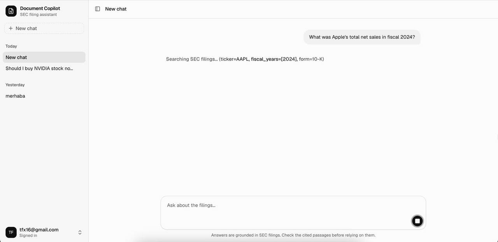
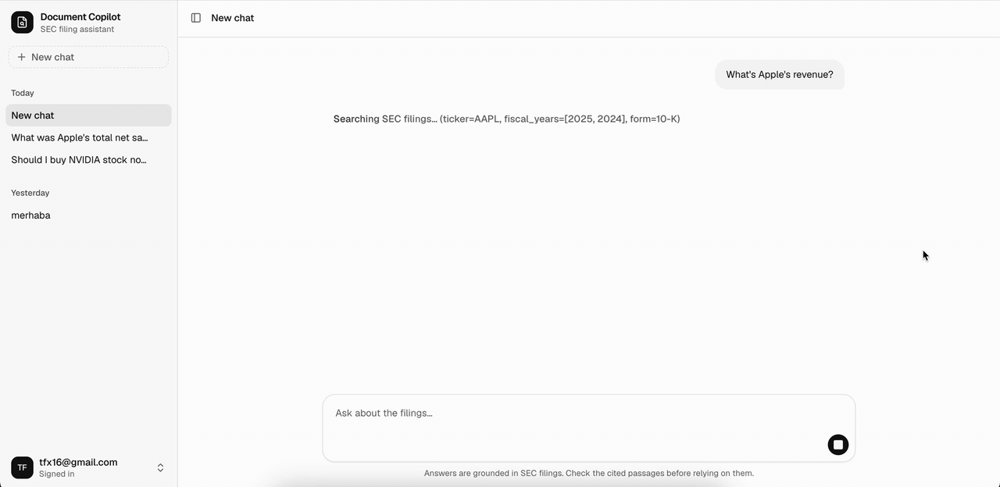
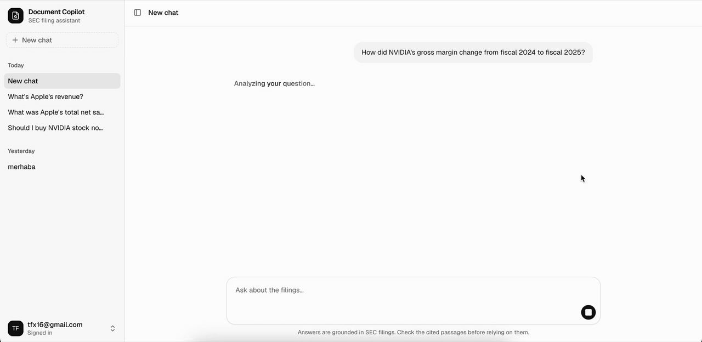
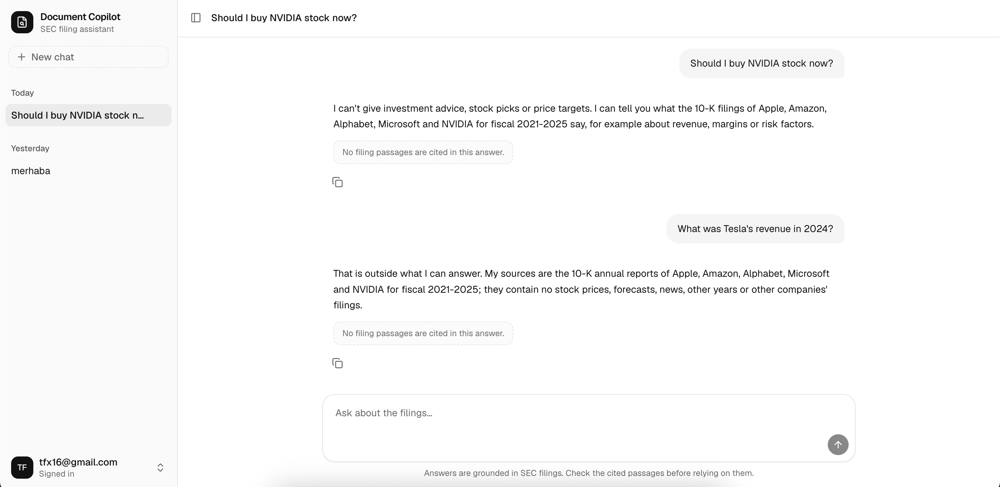
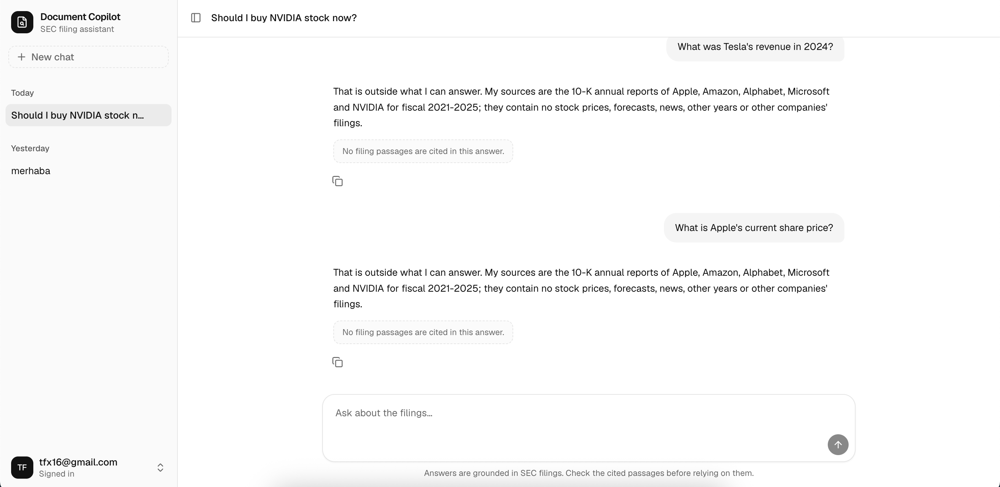
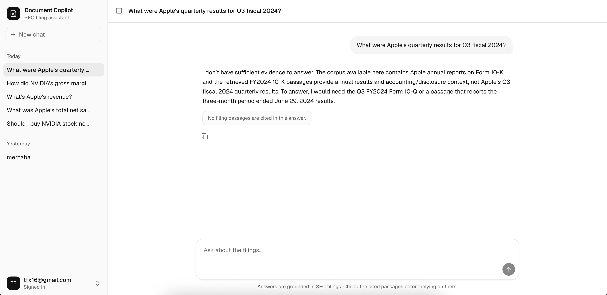

# Document Copilot

> İngilizce orijinal: [README.md](README.md)

Analistlerin bir doküman külliyatını sade İngilizceyle sorgulayıp kaynaklı, alıntılanabilir yanıtlar almasını sağlayan dahili bir yapay zekâ sohbet botu.

## Müşteri

**Driftwood Capital** — kurgusal, bağımsız bir yatırım araştırma firması. Analistleri, herhangi bir özgün analiz üretebilmeden önce haftalarının yarısını 10-K ve 10-Q raporlarını okuyarak geçiriyor. Document Copilot bu ön okuma işini üstlenir, böylece analistler doğrudan içgörüye geçebilir.

Tam brif: [docs/client-brief.tr.md](docs/client-brief.tr.md)

## Demo

Çalışan uygulamadan ekran kayıtları. Yüksek kaliteli videoyu açmak için animasyona tıklayın.

Her soru önce TypeSafe AI'ın tipli karar modeli **[Jev](https://docs.typesafe.ai/introduction)**'e gider. Jev tek istekte (~0,4 sn, ~0,00003 \$) sorunun kapsamını ve yatırım tavsiyesi isteyip istemediğini sınıflandırır, rotayı ise kod belirler: raporların yanıtlayamayacağı sorular ajan çalıştırılmadan sabit bir yanıt alır (ajan: gpt-5.5, soru başına ~60 sn ve ~0,3 \$). Korpus içi sorular ajana gider; yanıt deterministik doğrulayıcıdan geçtikten sonra Jev her iddiayı kaynaklarıyla karşılaştırır ve yanıtı engellemeyen bir risk sinyali üretir. Ayrıntılar: [mimari](docs/architecture.tr.md), [13. bölüm](docs/tutorials/tr/13-jev-tipli-kararlar.md).

### Kaynaklı yanıt

*What was Apple's total net sales in fiscal 2024?* → 391,035 milyar \$, FY2024 10-K'ya atıflı.

[](docs/media/demo-apple-net-sales-2024.mp4)

### Yıl verilmezse en son yıl

*What's Apple's revenue?* → en son raporu (FY2025, 416,161 milyar \$) kullanır ve bunu belirtir.

[](docs/media/demo-apple-latest-revenue.mp4)

### Kaynak pasajı açmak

*How did NVIDIA's gross margin change from fiscal 2024 to fiscal 2025?* → %72,7'den %75,0'a; kaynak paneli birebir alıntıyı gösterir.

[](docs/media/demo-nvidia-gross-margin.mp4)

### Jev yönlendirmesi: yatırım tavsiyesi ve başka şirket

*Should I buy NVIDIA stock now?*: Jev'in `advice` olasılığı 0,8'in üzerinde, sabit bir ret döner. *What was Tesla's revenue in 2024?*: Jev'in `scope` kararı `other_company`. İkisi de ajan çalıştırılmadan bir saniyenin altında yanıtlanır.



### Jev yönlendirmesi: yıllık raporda olamayacak veri

*What is Apple's current share price?*: Jev'in `scope` kararı `outside_filings` (fiyat, tahmin ve haberler 10-K'da yer almaz); soru ajan çalıştırılmadan yanıtlanır.



### Yetersiz kanıt

*What were Apple's quarterly results for Q3 fiscal 2024?*: Jev soruyu korpus içi görür ve ajana gönderir. Ajan 10-K'larda çeyreklik rakam bulamaz ve bunu kaynak göstermeden söyler.



## Stack

| Katman             | Seçim                                                   |
| ------------------ | ------------------------------------------------------- |
| Backend            | Python + FastAPI                                        |
| Frontend           | Vite + React SPA + TypeScript                           |
| Veritabanı         | Supabase Postgres (kullanıcılar, sohbetler, dokümanlar, parçalar) |
| Migration'lar      | SQLAlchemy modelleri + Alembic                          |
| Retrieval (getirme) | Supabase `pgvector` + Postgres full-text search        |
| Kimlik doğrulama   | Supabase Auth (yalnızca e-posta)                        |
| Barındırma         | Railway                                                 |
| LLM + embedding    | OpenAI                                                  |

## Repo yapısı

```text
document-copilot/
├── AGENTS.md           # agent talimatları (önce bunu oku)
├── README.md           # bu dosya
├── data/               # yerel külliyat + indirme script'i (indirilen dosyalar gitignore'da)
├── docs/
│   ├── client-brief.md # müşteri tek sayfalık özeti
│   ├── architecture.md # sistem tasarımı, veri modeli, grounding politikası
│   ├── guides/         # Supabase, backend, frontend ve Railway kurulumu
│   ├── todos.md        # fazlara göre yapım planı
│   └── tutorials/      # kitap düzeninde RAG anlatımı (en/, tr/)
├── backend/            # FastAPI servisi
└── frontend/           # React SPA (Vite)
```

## Ön gereksinimler

`backend/` veya `frontend/` kurulumundan önce bunları yükle:

| Araç | Sürüm | Kullanım amacı | Kurulum |
| ---- | ----- | -------------- | ------- |
| [Python](https://www.python.org/downloads/) | 3.14+ | Backend çalışma ortamı | İşletim sistemi paket yöneticisi veya python.org |
| [uv](https://docs.astral.sh/uv/getting-started/installation/) | en güncel | Backend bağımlılıkları + `data/download.py` | `curl -LsSf https://astral.sh/uv/install.sh \| sh` |
| [Node.js](https://nodejs.org/) | 23+ | Frontend araç zinciri | nodejs.org veya `nvm install 23` |
| [pnpm](https://pnpm.io/installation) | en güncel | Frontend paket yöneticisi | `corepack enable && corepack prepare pnpm@latest --activate` |

Uygulama bağlandıktan sonra harici servisler için hesap/anahtarlara da ihtiyacın olacak. [docs/guides/supabase-setup.tr.md](docs/guides/supabase-setup.tr.md) ile başla (hesap + proje), ardından LLM katmanı bağlandığında bir [OpenAI API anahtarı](https://platform.openai.com/api-keys) oluştur.

## Yerelde çalıştırma

[docs/guides/supabase-setup.tr.md](docs/guides/supabase-setup.tr.md) ile başla (hesap + proje), sonra env dosyalarını oluştur.

```bash
cp backend/.env.example backend/.env
cp frontend/.env.example frontend/.env
```

`backend/.env` içine:

- `SUPABASE_URL`, `SUPABASE_ANON_KEY`, `SUPABASE_SERVICE_ROLE_KEY`
- `DATABASE_URL`: Supabase Postgres'in doğrudan bağlantısı; transaction pooler (port 6543) değil
- `OPENAI_API_KEY`
- `ALLOWED_ORIGINS=http://localhost:5173`
- İsteğe bağlı: `TYPESAFE_API_KEY` Jev soru yönlendirmesini ve grounding risk sinyalini açar; yoksa ikisi de atlanır

`frontend/.env` içine: `VITE_API_BASE_URL=http://localhost:8000`, `VITE_SUPABASE_URL`, `VITE_SUPABASE_ANON_KEY`.

Kurulum, migration ve çalıştırma:

```bash
cd backend
uv sync
uv run alembic upgrade head
uv run uvicorn app.main:app --reload      # http://localhost:8000

cd frontend                               # ikinci bir terminalde
pnpm install
pnpm dev                                  # http://localhost:5173
```

Kayıt olma kapalı: kullanıcıları Supabase panelinden oluştur (Authentication → Users → Add user).
Sohbet için korpusun yüklenmiş olması gerekir; bkz. [Korpusu yüklemek](#korpusu-yüklemek).

Kontroller (ücretsiz, ücretli API çağrısı yok):

```bash
cd backend && uv run ruff check . && uv run pytest
cd frontend && pnpm lint && pnpm build
```

Bilerek çalıştırılan ücretli kontroller: `uv run python -m scripts.smoke_retrieval` (embedding, bir sentin çok altında) ve
`uv run python -m scripts.smoke_assistant --budget 1` (müşteri brifindeki sorularda ajan, soru başına ~$0,2–0,4).

## Örnek SEC verisi

SEC EDGAR'dan küçük bir yerel 10-K örneği çekmek için bağımsız indiriciyi kullan.
`data/download.py` dosyasının başındaki parametreleri, özellikle `USER_AGENT`'ı düzenle, ardından çalıştır:

```bash
uv run data/download.py
```

Varsayılan olarak AAPL, MSFT, NVDA, AMZN ve GOOGL için en son 5 adet 10-K raporunu `data/downloads/` altında yıl klasörlerine indirir ve bir `manifest.json` yazar.
İndirilen dosyalar gitignore'dadır; `data/` klasörünün kendisi script ve notlar için git'te kalır.

## Korpusu yüklemek

Ham SEC raporlarından aranabilir chunk'lara. Her adım idempotent: tekrar çalıştırmak yüklenmiş olanı atlar.

```bash
uv run data/download.py                                   # 1. SEC EDGAR'dan 10-K HTML -> data/downloads/
cd backend
uv run python ../data/convert_to_markdown.py              # 2. Docling ile HTML -> Markdown (ücretsiz, yerel)
uv run python -m ingest.load_source_documents             # 3. her rapor için bir source_documents satırı (ücretsiz)
uv run python -m ingest.chunk_and_embed --all --dry-run   # 4a. yalnızca chunk'la ve kontrol et (ücretsiz)
uv run python -m ingest.chunk_and_embed --all             # 4b. chunk'la, embed et (OpenAI, ücretli) ve yaz
```

Parsing değişikliğinden sonra tek bir raporu güncellemek için: `uv run python -m ingest.chunk_and_embed --accession <accession number> --force`.
25 pilot raporun (~16.500 chunk) embedding'i $1'ın çok altında tuttu; yavaş olan kısım vektörlerin Supabase'e yüklenmesi.
