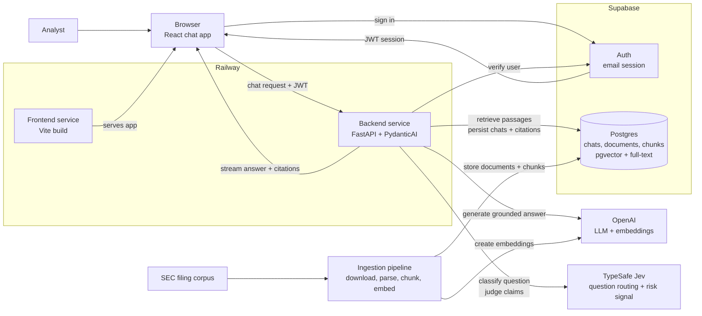
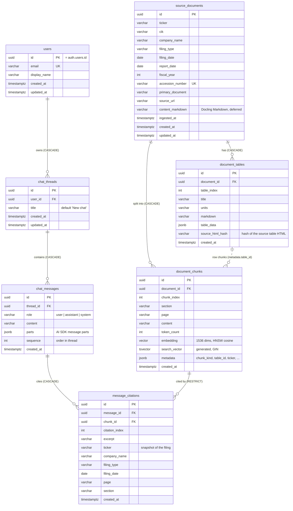

# Document Copilot Architecture

## Purpose

Document Copilot is an internal research assistant for analysts who need grounded answers from a curated SEC filing corpus. The architecture must optimize for trust: every answer is generated from retrieved source passages, every factual claim is citable, and the system fails clearly when the corpus does not support an answer.

This document describes the target architecture for the chat experience, LLM orchestration, and the communication layer between the React SPA, Supabase, and FastAPI backend.

## High-Level Architecture

The best opening diagram is a service-level view that shows the two core paths: the live chat path that serves users, and the ingestion path that prepares SEC filings for retrieval.



## Architectural Goals

- Keep the browser thin: it renders chat state, manages the user's Supabase session, and streams assistant responses.
- Keep the backend authoritative: retrieval, grounding, citation checks, tool execution, and database writes happen in FastAPI.
- Use Supabase for identity and durable product state: users, chat threads, source documents, chunks, embeddings, and citation metadata.
- Use Supabase `pgvector` for semantic retrieval and Postgres full-text search for keyword retrieval.
- Make the LLM path typed and testable by using PydanticAI agents with explicit dependencies, outputs, and tool boundaries.
- Preserve a simple deployment model on Railway: one frontend service, one stateless backend service, and hosted Supabase.

## Stack

Frontend:

- Vite + React SPA + TypeScript
- React Router for routing
- Tailwind CSS and shadcn/ui for UI
- `@supabase/supabase-js` for browser auth
- Vercel AI SDK UI packages for chat state and streaming client behavior

Backend:

- Python 3.14+
- FastAPI + Uvicorn
- Pydantic v2 + pydantic-settings
- PydanticAI for typed LLM orchestration
- OpenAI SDK for generation and embeddings
- Supabase Python client for server-side database access
- SQLAlchemy models + Alembic migrations for schema management
- Supabase `pgvector` for semantic search
- Postgres full-text search for lexical retrieval
- `httpx` for outbound HTTP
- `structlog` for structured logs

Persistence:

- Supabase Auth for email login
- Supabase Postgres for user records, chat threads, chat messages, source documents, chunks, embeddings, full-text search vectors, and citation metadata

## System Boundaries

The frontend is responsible for user interaction, local UI state, and sending the authenticated user's request to the backend. It should never hold service-role credentials, run retrieval logic, call OpenAI directly, or write privileged records to Supabase.

The backend is responsible for request authorization, retrieval, prompt construction, LLM execution, citation validation, streaming responses, and durable persistence. It owns all privileged credentials and is the only service allowed to use the Supabase service-role key.

Supabase is responsible for authentication and durable product state. Browser access uses the anon key and user JWT. Server access uses either the user's bearer token for user-scoped operations or the service-role key for privileged writes that must still be explicitly tied to the authenticated user.

## Request Flow

1. The user signs in with Supabase email auth in the React SPA.
2. The frontend stores the Supabase session through `@supabase/supabase-js`.
3. When the user opens a chat, the frontend loads the thread and prior messages through FastAPI, which reads user-scoped records from Supabase.
4. The chat UI uses the Vercel AI SDK React primitives to manage message state and submit new user messages to the FastAPI chat endpoint.
5. The frontend sends the Supabase access token as `Authorization: Bearer <token>`.
6. FastAPI verifies the token with Supabase Auth before doing any retrieval or LLM work.
7. FastAPI asks Jev (TypeSafe AI) to classify the question: in or out of the corpus, and whether it asks for investment advice. A confident advice or out-of-corpus question gets a fixed answer without an agent run; anything else, and any routing failure, goes on.
8. A PydanticAI agent (`gpt-5.5`) searches the filings with tools (hybrid search, full-chunk reads) and returns a typed `GroundedAnswer`: text with `[n]` markers and citations with verbatim excerpts.
9. The deterministic validator checks the citations against the chunks retrieved during the turn. On failure the turn ends with a controlled error and nothing is stored.
10. For a validated answer, numeric checks and Jev compute a per-claim risk signal (telemetry only).
11. FastAPI streams the answer text, citation parts and a transient risk part in the AI SDK format.
12. FastAPI persists the user message, the assistant message and the citation rows to Supabase.

## Frontend Chat Layer

The frontend remains a plain Vite SPA. It should not adopt Next.js route handlers or server components. The AI SDK is used only for its React chat primitives and streaming client behavior.

The chat module should be organized around these responsibilities:

- `src/lib/env.ts` validates `VITE_API_BASE_URL`, `VITE_SUPABASE_URL`, and `VITE_SUPABASE_ANON_KEY`.
- `src/lib/supabase.ts` creates the browser Supabase client.
- `src/lib/http.ts` wraps `fetch`, applies the backend base URL, injects the Supabase bearer token, handles timeouts, and converts failures into typed API errors.
- `src/lib/api.ts` exposes product-level calls such as loading threads, creating threads, and fetching message history.
- `src/pages/chat/*` renders chat routes and delegates chat streaming to a focused chat component.
- `src/components/chat/*` renders messages, citations, source passages, empty states, and streaming status.

The chat component should initialize with stored messages and then let the AI SDK manage in-flight UI state. The transport points to FastAPI, not to a frontend server route.

Conceptual shape:

```ts
const { messages, sendMessage, status, error } = useChat({
  id: threadId,
  messages: initialMessages,
  transport: new DefaultChatTransport({
    api: `${apiBaseUrl}/chat/stream`,
    headers: async () => ({
      Authorization: `Bearer ${await getAccessToken()}`,
    }),
  }),
});
```

The exact API surface should be verified during implementation against the installed AI SDK version. The architectural rule is stable: the browser streams to FastAPI with the user's Supabase token, and FastAPI owns the assistant run.

## Backend LLM Layer

PydanticAI should be introduced as the backend's orchestration layer for answer generation. It replaces ad hoc prompt calls with a typed agent boundary.

Backend modules:

```text
backend/app/
├── api/
│   ├── auth.py                 # /auth/me
│   └── chat.py                 # Thread routes and the streaming endpoint
├── auth/
│   └── dependencies.py         # Supabase JWT verification, current user
├── chat/
│   ├── orchestrator.py         # One turn: route → agent → validate → risk signal → stream → persist
│   ├── messages.py             # AI SDK messages ↔ stored rows, citation parts
│   └── streaming.py            # AI SDK UI message stream events (SSE)
├── assistant/
│   ├── agent.py                # PydanticAI agent and per-turn usage limits
│   ├── tools.py                # search_filings, read_chunks, read_chunk, read_surrounding_chunks
│   ├── deps.py                 # DocumentAgentDeps, TurnRegistry (the citation allowlist)
│   ├── outputs.py              # GroundedAnswer, Citation
│   ├── instructions.md         # Product contract
│   ├── router.py               # Jev question routing: advice and out-of-corpus questions
│   └── status.py, progress.py  # Status events for the UI and smoke scripts
├── retrieval/
│   ├── queries.py              # pgvector and full-text SQL
│   ├── keywords.py             # Full-text keywords (small model)
│   ├── embeddings.py           # Query embedding
│   ├── fusion.py               # Reciprocal Rank Fusion
│   ├── retriever.py            # Query → fused passages + neighbors
│   └── types.py                # SearchFilters, RetrievedPassage, agent formatting
├── grounding/
│   ├── validator.py            # Deterministic citation checks; fails closed
│   ├── numeric.py              # Figures checked against the cited sources in code
│   ├── claims.py               # Answer → claims (sentences, table rows)
│   ├── judge.py                # Jev requests
│   └── risk.py                 # Semantic risk signal; never fails an answer
├── database/
│   ├── models/                 # SQLAlchemy models, one file per table
│   ├── session.py              # Engine and sessions (direct Postgres)
│   ├── supabase.py             # Supabase clients
│   ├── chats.py, users.py      # Thread, message and citation persistence
│   └── documents.py            # Chunk lookups for retrieval and tools
└── config.py                   # Settings, the single source of truth
```

These names should follow the product workflow rather than a generic service layer. `chat/orchestrator.py` owns the full turn lifecycle, `assistant/agent.py` owns the LLM boundary, `retrieval/` owns hybrid source-passage search, and `grounding/` owns the trust contract that answers must cite retrieved evidence.

The agent should receive explicit dependencies rather than reaching into globals:

```python
@dataclass
class DocumentAgentDeps:
    retriever: DocumentRetriever
    registry: TurnRegistry            # every chunk a tool returned: the citation allowlist
    thread_id: UUID
    user_id: UUID
    on_status: StatusCallback | None = None


class GroundedAnswer(BaseModel):
    answer: str                       # text with [n] markers
    citations: list[Citation]         # citation_index, chunk_id, verbatim excerpt
    insufficient_evidence: bool = False
```

The agent's instructions should encode the product contract:

- Answer only from retrieved passages.
- Cite every factual claim.
- If the retrieved context is insufficient, say that the corpus does not contain enough evidence.
- Do not provide stock recommendations or investment advice.
- Keep answers concise enough for analyst review, but include enough cited passages to verify the answer.

Retrieval and grounding remain independent from PydanticAI. This keeps ingestion, retrieval tests, and citation validation testable without invoking the LLM.

## Retrieval Strategy

Document Copilot uses hybrid retrieval:

1. Embed the user's query with the configured OpenAI embedding model.
2. Run a semantic search over `document_chunks.embedding` with `pgvector`.
3. Run a lexical search over `document_chunks.search_vector` with Postgres full-text search.
4. Fuse the two ranked lists in Python with Reciprocal Rank Fusion.
5. Fetch the selected chunks, source document metadata, and optional neighboring chunks for grounding.

This keeps the database responsible for efficient ranked retrieval and keeps the application responsible for product-specific ranking policy. The first implementation should avoid agent-generated SQL; the PydanticAI agent receives bounded tools such as `search_filings`, `read_chunk`, and `read_surrounding_chunks`.

## Supabase and FastAPI Communication

Supabase Auth is the identity source. FastAPI must treat the browser's Supabase JWT as the request credential.

Frontend rules:

- Use the anon key only in the browser.
- Read the current session through the shared Supabase client.
- Send the access token to FastAPI through the shared API client.
- Never pass tokens through component props.
- Never expose the service-role key to the frontend.

Backend rules:

- Verify `Authorization: Bearer <token>` at the FastAPI boundary.
- Reject unauthenticated requests before retrieval or LLM work.
- Derive `user_id` and email from the verified Supabase user.
- Use user-scoped database operations wherever possible.
- Use the service-role key only on the backend for privileged writes that cannot be safely performed with the anon key.
- Always attach persisted chat records to the authenticated `user_id`.

The backend can verify the JWT by calling Supabase Auth's user endpoint or by validating the project's JWT signing keys. For the first implementation, calling Supabase Auth is simpler and avoids local JWT validation mistakes. If request volume grows, local JWT verification can be added behind the same `AuthService` interface.

Recommended backend units:

- `app/auth/dependencies.py` validates bearer tokens and exposes `get_current_user`.
- `app/database/supabase.py` creates user-scoped and admin Supabase clients.
- `app/database/chats.py` stores and reads chat threads, messages, and citation records.
- `app/database/documents.py` stores and reads source documents, chunks, embeddings, and full-text search data.

## Streaming Contract

The frontend should receive incremental assistant output, not wait for a full answer. FastAPI should expose a streaming endpoint that emits AI SDK-compatible message parts.

Recommended endpoint:

```text
POST /chat/stream
Authorization: Bearer <supabase_access_token>
Content-Type: application/json
```

Request body:

```json
{
  "threadId": "uuid",
  "messages": []
}
```

The `messages` payload should use the AI SDK UI message format at the frontend boundary. FastAPI can translate that wire format into internal Pydantic models before invoking the agent.

Streaming responsibilities:

- Send text deltas as the answer is generated.
- Send citation/source metadata as structured parts once available.
- Send clear error events for authentication failures, missing threads, retrieval failures, and grounding failures.
- Persist the turn once the assistant reply is fully generated, even if the client disconnects mid-stream: the complete reply exists before streaming starts, so the next history load can show it. The write is shielded from request cancellation. Never persist a partially generated reply, unless a separate partial-message model is deliberately introduced later. *(Decision changed 2026-09-28: previously "persist only after the assistant run completes successfully", which dropped fully generated replies when the client disconnected.)*

Thread endpoints (all under `/chat`, all require the bearer token):

- `GET /chat/threads` → `{"threads": [...]}`
- `POST /chat/threads` → the created thread
- `GET /chat/threads/{threadId}/messages` → `{"messages": [...]}` (AI SDK UI messages, in order)
- `DELETE /chat/threads/{threadId}` → `204`; messages and citations are removed by `ON DELETE CASCADE`

List responses are objects with a named list field rather than bare arrays, so fields can be added later without breaking clients. Thread fields use camelCase on the wire (`createdAt`, `updatedAt`). Another user's thread returns `403`, an unknown thread `404`. *(Decision changed 2026-09-28: bare-array list responses were replaced to match the reference implementation.)*

## Data Model

Supabase tables should be small and product-oriented:



Constraints and indexes beyond the diagram: unique `(document_id, chunk_index)` on `document_chunks`, `(document_id, table_index)` on `document_tables`, `(thread_id, sequence)` on `chat_messages` and `(message_id, citation_index)` on `message_citations`; an HNSW cosine index on `document_chunks.embedding` and a GIN index on `search_vector`; `(ticker, fiscal_year)` on `source_documents`. `alembic_version` holds the current migration revision. Deleting a filing removes its chunks and tables; a chunk that a stored answer cites cannot be deleted (`RESTRICT`), so re-ingesting a cited filing first removes the citations (see `ingest/chunk_and_embed.py`). The dotted line is a JSON reference, not a foreign key.


- `users`: one row per authenticated user, keyed by Supabase `auth.users.id`.
- `chat_threads`: thread metadata, owner, title, timestamps.
- `chat_messages`: user and assistant messages in order, with AI SDK-compatible message JSON where useful.
- `message_citations`: normalized citation records linked to assistant messages.
- `source_documents`: original document records with filing metadata, source URL, and normalized Markdown content.
- `document_chunks`: chunk text, chunk metadata, embeddings, and generated full-text search vectors.
- `document_tables`: financial tables re-extracted from each filing's raw HTML (clean Markdown, structured `table_data` JSON, title, units), in document order via `table_index`. Docling's Markdown mirrors the SEC HTML layout grid (repeated colspan cells, `$`/`%` in their own cells, spacer columns), which makes tables hard to read reliably, so `content_markdown` keeps the raw Docling output and clean tables live here. Tables are derived data: the chunking stage writes them together with the chunks that reference them, per document in one transaction, while `source_documents` is registered by a separate source stage. *(Added 2026-09-28, following the reference implementation.)*
- Chunks come in two kinds (`metadata.chunk_kind`): `narrative` text from Docling's HybridChunker (512 tokens), and `table_row`, one per clean table row (table title + units + header + that row, `metadata.table_id` → `document_tables`). Docling's own tables are matched to the clean tables before chunking and replaced by those rows at the same place, so no table is indexed twice; layout tables are flattened to text. `page` is derived from the page footers ("13-14" when a chunk crosses a page break) and `section` from the last `Item N.` heading, using the canonical 10-K item title. *(Decided 2026-09-28, improving on the reference, which kept Docling table text in narrative chunks and found page/section for only a small share of chunks.)*

`source_documents` stores the normalized Markdown version of each filing so the application can re-chunk, inspect, and cite the original extracted text without reaching back into downloaded HTML files. `document_chunks` stores retrieval-ready passages:

- chunk ID
- document ID
- chunk index
- page or section metadata
- chunk text
- embedding vector
- generated `tsvector` for full-text search
- token count
- metadata JSON for ticker, company, filing type, filing date, year, accession number, page, section, and source offsets

Hybrid retrieval runs two bounded queries against `document_chunks`: a semantic `pgvector` query and a Postgres full-text query. The backend fuses those ranked lists with Reciprocal Rank Fusion, then fetches the selected chunks and neighboring context for grounding.

Two retrieval details differ from the reference implementation *(decided 2026-09-29, measured on the client-brief questions)*:

- The semantic query enables pgvector's iterative index scan (`hnsw.iterative_scan = relaxed_order`) and re-sorts the candidates. Without it the HNSW scan stops at `ef_search` (40) candidates before applying the ticker/year filters, so a filtered search returned 3 passages instead of 50.
- The full-text query ORs the extracted keywords instead of ANDing them and ranks chunks by how many distinct keywords they contain, then by `ts_rank_cd`. ANDing five keywords matched nothing for 3 of the 10 test questions.

Stored chunk text has Markdown links reduced to their text (in-page anchors and EDGAR URLs are search noise).

## Schema Management

Database schema changes are managed from the backend with SQLAlchemy models and Alembic migrations. Supabase is the hosted Postgres database, but the Supabase dashboard is not the source of truth for table definitions.

The workflow is:

1. Update SQLAlchemy models in `app/database/models.py`.
2. Generate a candidate migration with `uv run alembic revision --autogenerate -m "<change>"`.
3. Review the generated migration file in `backend/alembic/versions/`.
4. Add explicit migration operations for Postgres/Supabase features that autogenerate cannot infer reliably.
5. Apply the migration locally or against the linked Supabase database with `uv run alembic upgrade head`.
6. Commit both the model changes and the migration file.

Normal tables and ordinary indexes should be represented in SQLAlchemy models where practical. The following should be written explicitly in migrations with `op.execute()` or carefully reviewed Alembic operations:

- `create extension if not exists vector`
- `vector(1536)` embedding columns if the SQLAlchemy type renderer is not sufficient
- generated `tsvector` columns
- HNSW indexes for vector search
- GIN indexes for full-text search and JSON metadata
- RLS enablement and policies
- grants or Supabase role-specific permissions

Alembic must connect with Supabase's direct/session database connection string. Do not run migrations through the transaction pooler URL, because schema migrations, extension setup, and index creation require session-level database behavior.

## Grounding and Citation Policy

Grounding is part of the architecture, not a prompt preference.

The backend should enforce these invariants:

- Every assistant answer has at least one citation unless the answer explicitly says there is not enough evidence.
- Every citation maps to a retrieved source passage.
- Cited passages include enough metadata for the frontend to show company, filing, date, page or section, and excerpt.
- The model cannot cite documents that were not retrieved for the current request.
- If citation validation fails, the backend returns a controlled failure instead of a polished unsupported answer.

This policy should be covered by backend unit tests around retrieval, citation extraction, and grounding enforcement.

`grounding/validator.py` enforces this deterministically, with no LLM call: each `[n]` marker must match a citation, each citation's chunk must have been returned by a tool during the turn, each excerpt must appear verbatim in that chunk, and a money amount or percentage on a line without any marker fails the answer. Excerpts are compared on words and numbers, forgiving whitespace, typography (quotes, hyphen variants) and Markdown table markup. This is the only layer that decides whether an answer is shown.

Two more layers run on validated answers and never fail one (`grounding/risk.py`). `grounding/numeric.py` checks each figure against the cited sources in code: exact, unit-converted ($25.0B for 24,967 in a millions table) or computed as a share, margin or growth rate. Jev then judges each claim, a sentence or table row with all its citations, as supported, contradicted or uncertain, in one batched request per answer. The result is a per-claim risk level (none, warning, high) for logs and the UI; Jev's doubt is ignored when code verified every figure of the claim. The reference implementation blocks answers on an LLM judge instead; measured on this corpus, a blocking semantic judge rejected correct answers whose figures were unit-converted or computed, so here the semantic check is a signal, not a gate. *(Decided 2026-09-29.)*

## Error Handling

Expected error classes:

- `401 Unauthorized`: missing, expired, or invalid Supabase token.
- `403 Forbidden`: authenticated user tries to access another user's thread.
- `404 Not Found`: thread or source document does not exist.
- `422 Unprocessable Entity`: invalid request payload.
- `502 Bad Gateway`: upstream LLM or Supabase failure.
- `500 Internal Server Error`: unexpected backend failure.

The frontend should render friendly messages while preserving enough technical detail in logs for debugging. Network and CORS failures should be distinguishable from HTTP failures in the shared API client.

## Configuration

Each service must keep one settings module as the source of truth.

Frontend settings:

- `VITE_API_BASE_URL`
- `VITE_SUPABASE_URL`
- `VITE_SUPABASE_ANON_KEY`

Backend settings:

- `SUPABASE_URL`
- `SUPABASE_ANON_KEY`
- `SUPABASE_SERVICE_ROLE_KEY`
- `DATABASE_URL` for Alembic and direct Postgres access
- `OPENAI_API_KEY`
- `ALLOWED_ORIGINS`
- embedding model name and dimensions
- `OPENAI_CHAT_MODEL` (default `gpt-5.5`) and the per-turn agent limits (`OPENAI_AGENT_*`: requests, tool calls, tokens)
- `TYPESAFE_API_KEY` (optional): Jev question routing and risk signal; without it both are skipped

Do not read environment variables directly from components, route handlers, or services. Frontend code should use `src/lib/env.ts`. Backend code should use `app/config.py`.

## Deployment Shape

Railway should run two services:

- Frontend: static Vite build served as a web app.
- Backend: FastAPI service running Uvicorn.

Each service builds from its own Dockerfile: `backend/Dockerfile` (the API only; Docling and ingestion stay on developer machines) and `frontend/Dockerfile` (Vite build served by Caddy, `frontend/Caddyfile`). Steps: [docs/guides/railway-deployment.md](guides/railway-deployment.md).

Supabase remains hosted and stores the durable retrieval data. The Railway backend can stay stateless because document chunks, embeddings, full-text search vectors, chats, and citations all live in Supabase Postgres. Raw downloaded filings remain gitignored local ingestion inputs unless a later workflow stores them in object storage.

## Implementation Sequence

1. Scaffold the frontend SPA and backend FastAPI app according to the repo conventions.
2. Add SQLAlchemy models and Alembic migration setup in the backend.
3. Add the initial Alembic migration for `pgvector`, source document, chunk, full-text, chat, and citation tables.
4. Add Supabase Auth in the frontend and token verification in FastAPI.
5. Add the shared frontend API client with automatic bearer-token injection.
6. Add the chat streaming endpoint with a stubbed assistant response.
7. Add AI SDK chat UI on the frontend pointed at FastAPI.
8. Add Markdown ingestion, chunking, embeddings, and Supabase writes.
9. Add semantic search with `pgvector`.
10. Add Postgres full-text search and Python RRF fusion.
11. Add PydanticAI document agent with typed dependencies and typed answer output.
12. Add citation validation and grounding enforcement.
13. Add final UI for citations, source passages, empty states, and errors.

## Non-Goals

- No Next.js, SSR, server components, or frontend route handlers.
- No direct OpenAI calls from the browser.
- No separate managed vector database outside Supabase.
- No multi-tenant architecture.
- No external market/news data.
- No trading recommendations or generated stock picks.
