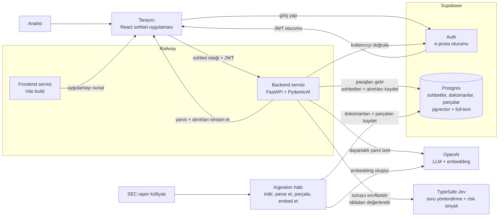
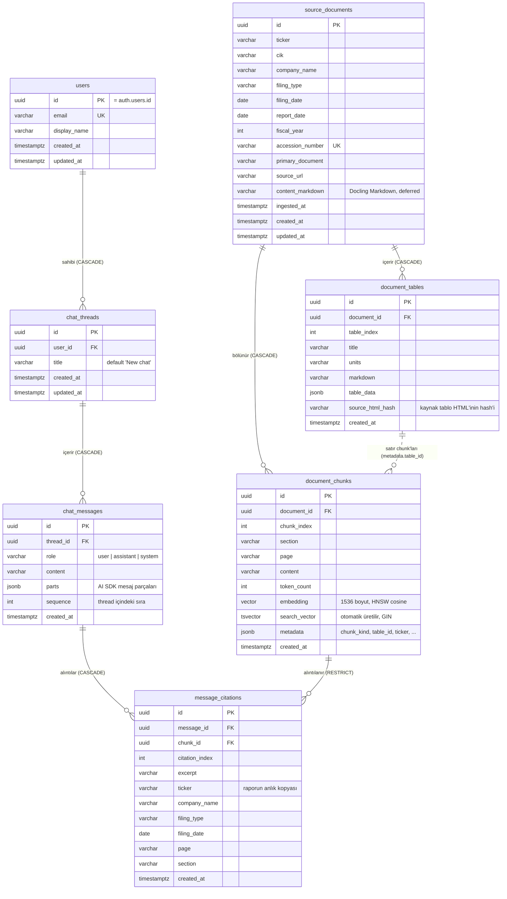

# Document Copilot Mimarisi

> İngilizce orijinal: [architecture.md](architecture.md)

## Amaç

Document Copilot, seçilmiş bir SEC raporu külliyatından dayanaklı (grounded) yanıtlara ihtiyaç duyan analistler için dahili bir araştırma asistanıdır. Mimari güven için optimize edilmelidir: her yanıt getirilen kaynak pasajlardan üretilir, her olgusal iddia alıntılanabilir ve külliyat bir yanıtı desteklemediğinde sistem bunu açıkça belirterek başarısız olur.

Bu doküman sohbet deneyiminin, LLM orkestrasyonunun ve React SPA, Supabase ile FastAPI backend arasındaki iletişim katmanının hedef mimarisini tanımlar.

## Üst Seviye Mimari

En iyi açılış diyagramı, iki ana yolu gösteren servis seviyesi bir görünümdür: kullanıcılara hizmet veren canlı sohbet yolu ve SEC raporlarını retrieval için hazırlayan ingestion yolu.



## Mimari Hedefler

- Tarayıcıyı ince tut: sohbet durumunu render eder, kullanıcının Supabase oturumunu yönetir ve asistan yanıtlarını stream eder.
- Backend'i yetkili tut: retrieval, grounding, alıntı kontrolleri, araç (tool) çalıştırma ve veritabanı yazmaları FastAPI'de gerçekleşir.
- Kimlik ve kalıcı ürün durumu için Supabase kullan: kullanıcılar, sohbet thread'leri, kaynak dokümanlar, parçalar, embedding'ler ve alıntı metadata'sı.
- Semantik retrieval için Supabase `pgvector`, anahtar kelime retrieval'ı için Postgres full-text search kullan.
- Açık bağımlılıklara, çıktılara ve araç sınırlarına sahip PydanticAI agent'ları kullanarak LLM yolunu tipli ve test edilebilir yap.
- Railway'de basit bir dağıtım modelini koru: bir frontend servisi, bir durumsuz (stateless) backend servisi ve barındırılan Supabase.

## Stack

Frontend:

- Vite + React SPA + TypeScript
- Routing için React Router
- UI için Tailwind CSS ve shadcn/ui
- Tarayıcı kimlik doğrulaması için `@supabase/supabase-js`
- Sohbet durumu ve streaming istemci davranışı için Vercel AI SDK UI paketleri

Backend:

- Python 3.14+
- FastAPI + Uvicorn
- Pydantic v2 + pydantic-settings
- Tipli LLM orkestrasyonu için PydanticAI
- Üretim ve embedding'ler için OpenAI SDK
- Sunucu tarafı veritabanı erişimi için Supabase Python istemcisi
- Şema yönetimi için SQLAlchemy modelleri + Alembic migration'ları
- Semantik arama için Supabase `pgvector`
- Sözcüksel (lexical) retrieval için Postgres full-text search
- Dışa giden HTTP için `httpx`
- Yapılandırılmış loglar için `structlog`

Kalıcılık:

- E-posta ile giriş için Supabase Auth
- Kullanıcı kayıtları, sohbet thread'leri, sohbet mesajları, kaynak dokümanlar, parçalar, embedding'ler, full-text search vektörleri ve alıntı metadata'sı için Supabase Postgres

## Sistem Sınırları

Frontend; kullanıcı etkileşiminden, yerel UI durumundan ve kimliği doğrulanmış kullanıcının isteğini backend'e göndermekten sorumludur. Asla service-role kimlik bilgilerini tutmamalı, retrieval mantığı çalıştırmamalı, OpenAI'ı doğrudan çağırmamalı veya Supabase'e ayrıcalıklı kayıtlar yazmamalıdır.

Backend; istek yetkilendirmesinden, retrieval'dan, prompt oluşturmadan, LLM çalıştırmadan, alıntı doğrulamadan, yanıtların stream edilmesinden ve kalıcı depolamadan sorumludur. Tüm ayrıcalıklı kimlik bilgilerinin sahibidir ve Supabase service-role anahtarını kullanmasına izin verilen tek servistir.

Supabase, kimlik doğrulamadan ve kalıcı ürün durumundan sorumludur. Tarayıcı erişimi anon anahtarını ve kullanıcı JWT'sini kullanır. Sunucu erişimi, kullanıcı kapsamlı işlemler için kullanıcının bearer token'ını veya yine de açıkça kimliği doğrulanmış kullanıcıya bağlanması gereken ayrıcalıklı yazmalar için service-role anahtarını kullanır.

## İstek Akışı

1. Kullanıcı React SPA'da Supabase e-posta auth ile giriş yapar.
2. Frontend, Supabase oturumunu `@supabase/supabase-js` aracılığıyla saklar.
3. Kullanıcı bir sohbet açtığında frontend, thread'i ve önceki mesajları FastAPI üzerinden yükler; FastAPI de kullanıcı kapsamlı kayıtları Supabase'den okur.
4. Sohbet UI'ı, mesaj durumunu yönetmek ve yeni kullanıcı mesajlarını FastAPI sohbet endpoint'ine göndermek için Vercel AI SDK React primitive'lerini kullanır.
5. Frontend, Supabase access token'ını `Authorization: Bearer <token>` olarak gönderir.
6. FastAPI, herhangi bir retrieval veya LLM işi yapmadan önce token'ı Supabase Auth ile doğrular.
7. FastAPI, soruyu Jev'e (TypeSafe AI) sınıflandırtır: korpusun içinde mi dışında mı, yatırım tavsiyesi istiyor mu. Güvenle tavsiye ya da korpus dışı bulunan soru ajan çalışmadan sabit bir cevap alır; diğer her soru ve her yönlendirme hatası devam eder.
8. Bir PydanticAI ajanı (`gpt-5.5`) araçlarla raporlarda arar (hibrit arama, tam chunk okuma) ve tipli bir `GroundedAnswer` döndürür: `[n]` işaretli metin ve birebir alıntılı atıflar.
9. Deterministik validator, alıntıları bu turda getirilen chunk'lara karşı kontrol eder. Başarısız olursa tur kontrollü bir hatayla biter ve hiçbir şey kaydedilmez.
10. Doğrulanmış cevap için sayısal kontroller ve Jev, iddia başına bir risk sinyali hesaplar (yalnızca telemetri).
11. FastAPI; cevap metnini, alıntı parçalarını ve geçici bir risk parçasını AI SDK formatında stream eder.
12. FastAPI; kullanıcı mesajını, asistan mesajını ve alıntı satırlarını Supabase'e kaydeder.

## Frontend Sohbet Katmanı

Frontend düz bir Vite SPA olarak kalır. Next.js route handler'larını veya server component'leri benimsememelidir. AI SDK yalnızca React sohbet primitive'leri ve streaming istemci davranışı için kullanılır.

Sohbet modülü şu sorumluluklar etrafında düzenlenmelidir:

- `src/lib/env.ts`, `VITE_API_BASE_URL`, `VITE_SUPABASE_URL` ve `VITE_SUPABASE_ANON_KEY`'i doğrular.
- `src/lib/supabase.ts` tarayıcı Supabase istemcisini oluşturur.
- `src/lib/http.ts`, `fetch`'i sarar; backend base URL'sini uygular, Supabase bearer token'ını ekler, timeout'ları yönetir ve hataları tipli API hatalarına dönüştürür.
- `src/lib/api.ts`, thread'leri yükleme, thread oluşturma ve mesaj geçmişini getirme gibi ürün seviyesi çağrıları sunar.
- `src/pages/chat/*` sohbet route'larını render eder ve sohbet streaming'ini odaklı bir sohbet component'ine devreder.
- `src/components/chat/*` mesajları, alıntıları, kaynak pasajları, boş durumları ve streaming durumunu render eder.

Sohbet component'i kayıtlı mesajlarla başlatılmalı, ardından uçuştaki (in-flight) UI durumunu AI SDK'nın yönetmesine izin vermelidir. Transport, bir frontend sunucu route'una değil FastAPI'ye işaret eder.

Kavramsal şekil:

```ts
const { messages, sendMessage, status, error } = useChat({
  id: threadId,
  messages: initialMessages,
  transport: new DefaultChatTransport({
    api: `${apiBaseUrl}/chat/stream`,
    headers: async () => ({
      Authorization: `Bearer ${await getAccessToken()}`,
    }),
  }),
});
```

Tam API yüzeyi, uygulama sırasında kurulu AI SDK sürümüne göre doğrulanmalıdır. Mimari kural sabittir: tarayıcı, kullanıcının Supabase token'ı ile FastAPI'ye stream eder ve asistan çalıştırmasının sahibi FastAPI'dir.

## Backend LLM Katmanı

PydanticAI, yanıt üretimi için backend'in orkestrasyon katmanı olarak kullanılmalıdır. Rastgele (ad hoc) prompt çağrılarını tipli bir agent sınırıyla değiştirir.

Backend modülleri:

```text
backend/app/
├── api/
│   ├── auth.py                 # /auth/me
│   └── chat.py                 # Thread route'ları ve streaming endpoint'i
├── auth/
│   └── dependencies.py         # Supabase JWT doğrulaması, geçerli kullanıcı
├── chat/
│   ├── orchestrator.py         # Bir tur: yönlendirme → ajan → doğrulama → risk sinyali → stream → kayıt
│   ├── messages.py             # AI SDK mesajları ↔ kayıtlı satırlar, alıntı parçaları
│   └── streaming.py            # AI SDK UI message stream olayları (SSE)
├── assistant/
│   ├── agent.py                # PydanticAI ajanı ve tur başına kullanım sınırları
│   ├── tools.py                # search_filings, read_chunks, read_chunk, read_surrounding_chunks
│   ├── deps.py                 # DocumentAgentDeps, TurnRegistry (alıntı izin listesi)
│   ├── outputs.py              # GroundedAnswer, Citation
│   ├── instructions.md         # Ürün sözleşmesi
│   ├── router.py               # Jev ile soru yönlendirme: tavsiye ve korpus dışı sorular
│   └── status.py, progress.py  # Arayüz ve smoke script'ler için durum olayları
├── retrieval/
│   ├── queries.py              # pgvector ve full-text SQL
│   ├── keywords.py             # Full-text anahtar kelimeleri (küçük model)
│   ├── embeddings.py           # Sorgu embedding'i
│   ├── fusion.py               # Reciprocal Rank Fusion
│   ├── retriever.py            # Sorgu → birleştirilmiş pasajlar + komşular
│   └── types.py                # SearchFilters, RetrievedPassage, ajan formatı
├── grounding/
│   ├── validator.py            # Deterministik alıntı kontrolleri; fail closed
│   ├── numeric.py              # Rakamların alıntılanan kaynaklara karşı kodla kontrolü
│   ├── claims.py               # Cevap → iddialar (cümleler, tablo satırları)
│   ├── judge.py                # Jev istekleri
│   └── risk.py                 # Anlamsal risk sinyali; cevabı asla başarısız kılmaz
├── database/
│   ├── models/                 # SQLAlchemy modelleri, her tablo için bir dosya
│   ├── session.py              # Engine ve session'lar (doğrudan Postgres)
│   ├── supabase.py             # Supabase istemcileri
│   ├── chats.py, users.py      # Thread, mesaj ve alıntı kaydı
│   └── documents.py            # Retrieval ve araçlar için chunk sorguları
└── config.py                   # Ayarlar, tek doğruluk kaynağı
```

Bu isimler genel bir servis katmanı yerine ürün iş akışını takip etmelidir. `chat/orchestrator.py` tur yaşam döngüsünün tamamına, `assistant/agent.py` LLM sınırına, `retrieval/` hibrit kaynak pasaj aramasına, `grounding/` ise yanıtların getirilen kanıtlara atıf yapması gerektiği güven sözleşmesine sahiptir.

Agent, global'lere uzanmak yerine açık bağımlılıklar almalıdır:

```python
@dataclass
class DocumentAgentDeps:
    retriever: DocumentRetriever
    registry: TurnRegistry            # bir aracın döndürdüğü her chunk: alıntı izin listesi
    thread_id: UUID
    user_id: UUID
    on_status: StatusCallback | None = None


class GroundedAnswer(BaseModel):
    answer: str                       # [n] işaretli metin
    citations: list[Citation]         # citation_index, chunk_id, birebir alıntı
    insufficient_evidence: bool = False
```

Agent'ın talimatları ürün sözleşmesini kodlamalıdır:

- Yalnızca getirilen pasajlardan yanıt ver.
- Her olgusal iddiaya alıntı ekle.
- Getirilen bağlam yetersizse, külliyatın yeterli kanıt içermediğini söyle.
- Hisse önerisi veya yatırım tavsiyesi verme.
- Yanıtları analist incelemesi için yeterince kısa tut, ancak yanıtı doğrulamaya yetecek kadar alıntılanmış pasaj ekle.

Retrieval ve grounding PydanticAI'dan bağımsız kalır. Bu, ingestion'ı, retrieval testlerini ve alıntı doğrulamayı LLM'i çağırmadan test edilebilir tutar.

## Retrieval Stratejisi

Document Copilot hibrit retrieval kullanır:

1. Kullanıcının sorgusunu yapılandırılmış OpenAI embedding modeliyle embed et.
2. `document_chunks.embedding` üzerinde `pgvector` ile semantik arama çalıştır.
3. `document_chunks.search_vector` üzerinde Postgres full-text search ile sözcüksel arama çalıştır.
4. İki sıralı listeyi Python'da Reciprocal Rank Fusion ile birleştir.
5. Seçilen parçaları, kaynak doküman metadata'sını ve grounding için isteğe bağlı komşu parçaları getir.

Bu yaklaşım, verimli sıralı retrieval'ın sorumluluğunu veritabanında, ürüne özel sıralama politikasının sorumluluğunu uygulamada tutar. İlk uygulama, agent tarafından üretilen SQL'den kaçınmalıdır; PydanticAI agent'ı `search_filings`, `read_chunk` ve `read_surrounding_chunks` gibi sınırlandırılmış araçlar alır.

## Supabase ve FastAPI İletişimi

Kimlik kaynağı Supabase Auth'tur. FastAPI, tarayıcının Supabase JWT'sini istek kimlik bilgisi olarak kabul etmelidir.

Frontend kuralları:

- Tarayıcıda yalnızca anon anahtarını kullan.
- Mevcut oturumu paylaşılan Supabase istemcisi üzerinden oku.
- Access token'ı FastAPI'ye paylaşılan API istemcisi üzerinden gönder.
- Token'ları asla component prop'ları üzerinden geçirme.
- Service-role anahtarını asla frontend'e açma.

Backend kuralları:

- `Authorization: Bearer <token>`'ı FastAPI sınırında doğrula.
- Kimliği doğrulanmamış istekleri retrieval veya LLM işinden önce reddet.
- `user_id` ve e-postayı doğrulanmış Supabase kullanıcısından türet.
- Mümkün olan her yerde kullanıcı kapsamlı veritabanı işlemleri kullan.
- Service-role anahtarını yalnızca backend'de, anon anahtarıyla güvenli şekilde yapılamayan ayrıcalıklı yazmalar için kullan.
- Kalıcı sohbet kayıtlarını her zaman kimliği doğrulanmış `user_id`'ye bağla.

Backend, JWT'yi Supabase Auth'un kullanıcı endpoint'ini çağırarak veya projenin JWT imzalama anahtarlarını doğrulayarak doğrulayabilir. İlk uygulama için Supabase Auth'u çağırmak daha basittir ve yerel JWT doğrulama hatalarından kaçınır. İstek hacmi artarsa, yerel JWT doğrulaması aynı `AuthService` arayüzünün arkasına eklenebilir.

Önerilen backend birimleri:

- `app/auth/dependencies.py` bearer token'ları doğrular ve `get_current_user`'ı sunar.
- `app/database/supabase.py` kullanıcı kapsamlı ve admin Supabase istemcilerini oluşturur.
- `app/database/chats.py` sohbet thread'lerini, mesajları ve alıntı kayıtlarını saklar ve okur.
- `app/database/documents.py` kaynak dokümanları, parçaları, embedding'leri ve full-text search verilerini saklar ve okur.

## Streaming Sözleşmesi

Frontend, tam bir yanıtı beklemek yerine artımlı (incremental) asistan çıktısı almalıdır. FastAPI, AI SDK uyumlu mesaj parçaları yayan bir streaming endpoint'i sunmalıdır.

Önerilen endpoint:

```text
POST /chat/stream
Authorization: Bearer <supabase_access_token>
Content-Type: application/json
```

İstek gövdesi:

```json
{
  "threadId": "uuid",
  "messages": []
}
```

`messages` yükü, frontend sınırında AI SDK UI mesaj formatını kullanmalıdır. FastAPI, agent'ı çağırmadan önce bu wire formatını dahili Pydantic modellerine çevirebilir.

Streaming sorumlulukları:

- Yanıt üretildikçe metin parçalarını (delta) gönder.
- Alıntı/kaynak metadata'sını hazır olduğunda yapılandırılmış parçalar olarak gönder.
- Kimlik doğrulama hataları, eksik thread'ler, retrieval hataları ve grounding hataları için net hata olayları gönder.
- Asistan cevabı tamamen üretildikten sonra turu kaydet; istemci stream'in ortasında bağlantıyı kesse bile. Cevabın tamamı stream başlamadan önce hazır olduğu için, bir sonraki geçmiş yüklemesinde gösterilebilir. Kayıt işlemi istek iptaline karşı korunur (shield). Daha sonra bilinçli olarak ayrı bir kısmi mesaj modeli eklenmedikçe, yarım üretilmiş bir cevabı asla kaydetme. *(Karar 2026-09-28'de değişti: önceki kural "yalnızca asistan çalıştırması başarıyla tamamlandıktan sonra kaydet" idi; bu, istemci bağlantıyı kestiğinde tamamen üretilmiş cevapların kaybolmasına yol açıyordu.)*

Thread endpoint'leri (hepsi `/chat` altında, hepsi bearer token gerektirir):

- `GET /chat/threads` → `{"threads": [...]}`
- `POST /chat/threads` → oluşturulan thread
- `GET /chat/threads/{threadId}/messages` → `{"messages": [...]}` (sıralı AI SDK UI mesajları)
- `DELETE /chat/threads/{threadId}` → `204`; mesajlar ve alıntılar `ON DELETE CASCADE` ile silinir

Liste yanıtları çıplak dizi yerine adlandırılmış bir liste alanı olan nesnelerdir; böylece ileride istemcileri bozmadan alan eklenebilir. Thread alanları API'de camelCase'dir (`createdAt`, `updatedAt`). Başka bir kullanıcının thread'i `403`, bilinmeyen bir thread `404` döner. *(Karar 2026-09-28'de değişti: referans implementasyonla uyum için çıplak dizi dönen liste yanıtlarının yerine bu yapı geldi.)*

## Veri Modeli

Supabase tabloları küçük ve ürün odaklı olmalıdır:



Diyagramın dışındaki kısıtlar ve index'ler: `document_chunks` üzerinde tekil `(document_id, chunk_index)`, `document_tables` üzerinde `(document_id, table_index)`, `chat_messages` üzerinde `(thread_id, sequence)` ve `message_citations` üzerinde `(message_id, citation_index)`; `document_chunks.embedding` üzerinde HNSW cosine index'i ve `search_vector` üzerinde GIN index'i; `source_documents` üzerinde `(ticker, fiscal_year)`. `alembic_version` güncel migration sürümünü tutar. Bir rapor silinince chunk'ları ve tabloları da silinir; kayıtlı bir cevabın alıntıladığı chunk silinemez (`RESTRICT`), bu yüzden alıntılanmış bir raporu yeniden yüklemek önce alıntıları siler (bkz. `ingest/chunk_and_embed.py`). Noktalı çizgi bir foreign key değil, JSON içindeki bir referanstır.


- `users`: kimliği doğrulanmış her kullanıcı için bir satır, Supabase `auth.users.id` ile anahtarlanır.
- `chat_threads`: thread metadata'sı, sahip, başlık, zaman damgaları.
- `chat_messages`: sıralı kullanıcı ve asistan mesajları, faydalı olduğu yerde AI SDK uyumlu mesaj JSON'u ile.
- `message_citations`: asistan mesajlarına bağlı normalize edilmiş alıntı kayıtları.
- `source_documents`: rapor metadata'sı, kaynak URL ve normalize edilmiş Markdown içeriği ile orijinal doküman kayıtları.
- `document_chunks`: parça metni, parça metadata'sı, embedding'ler ve generated full-text search vektörleri.
- `document_tables`: her raporun ham HTML'inden yeniden çıkarılan finansal tablolar (temiz Markdown, yapılandırılmış `table_data` JSON'u, başlık, birim), `table_index` ile doküman sırasında. Docling'in Markdown'u SEC HTML'inin düzen ızgarasını birebir yansıtır (tekrarlanan colspan hücreleri, ayrı hücrelerde `$`/`%`, boşluk sütunları); bu da tabloların güvenilir okunmasını zorlaştırır. Bu yüzden `content_markdown` ham Docling çıktısını tutar, temiz tablolar burada durur. Tablolar türetilmiş veridir: chunking adımı onları, kendilerine referans veren chunk'larla birlikte, doküman başına tek bir transaction'da yazar; `source_documents` ise ayrı bir kaynak adımında kaydedilir. *(2026-09-28'de referans implementasyona uygun olarak eklendi.)*
- Chunk'lar iki türdür (`metadata.chunk_kind`): Docling HybridChunker'dan gelen `narrative` metin (512 token) ve her temiz tablo satırı için bir `table_row` (tablo başlığı + birim + başlık satırı + o satır, `metadata.table_id` → `document_tables`). Docling'in kendi tabloları chunking'den önce temiz tablolarla eşleştirilir ve aynı yerde bu satırlarla değiştirilir; böylece hiçbir tablo iki kez indekslenmez. Düzen tabloları düz metne çevrilir. `page` sayfa altlıklarından çıkarılır (chunk sayfa sonunu geçiyorsa "13-14"), `section` ise son `Item N.` başlığından, standart 10-K madde adıyla. *(2026-09-28'de karar verildi; referansı iyileştirir: referans Docling tablo metnini metin chunk'larında bırakıyor ve sayfa/bölümü chunk'ların yalnızca küçük bir kısmı için bulabiliyordu.)*

`source_documents`, her raporun normalize edilmiş Markdown sürümünü saklar; böylece uygulama indirilen HTML dosyalarına geri dönmeden orijinal çıkarılmış metni yeniden parçalayabilir, inceleyebilir ve alıntılayabilir. `document_chunks` retrieval'a hazır pasajları saklar:

- parça ID'si
- doküman ID'si
- parça indeksi
- sayfa veya bölüm metadata'sı
- parça metni
- embedding vektörü
- full-text search için generated `tsvector`
- token sayısı
- ticker, şirket, rapor tipi, rapor tarihi, yıl, accession number, sayfa, bölüm ve kaynak offset'leri için metadata JSON'u

Hibrit retrieval, `document_chunks` üzerinde iki sınırlandırılmış sorgu çalıştırır: semantik bir `pgvector` sorgusu ve bir Postgres full-text sorgusu. Backend bu sıralı listeleri Reciprocal Rank Fusion ile birleştirir, ardından seçilen parçaları ve grounding için komşu bağlamı getirir.

İki retrieval ayrıntısı referans implementasyondan farklıdır *(2026-09-29'da client brief soruları üzerinde ölçülerek karar verildi)*:

- Semantik sorgu pgvector'ün iterative index scan özelliğini açar (`hnsw.iterative_scan = relaxed_order`) ve adayları yeniden sıralar. Bu olmadan HNSW taraması ticker/yıl filtrelerini uygulamadan önce `ef_search` (40) adayda durur; filtreli bir arama 50 yerine 3 pasaj döndürüyordu.
- Full-text sorgusu çıkarılan anahtar kelimeleri VE yerine VEYA ile birleştirir ve chunk'ları önce içerdikleri farklı anahtar kelime sayısına, sonra `ts_rank_cd`'ye göre sıralar. Beş anahtar kelimeyi VE'lemek 10 test sorusunun 3'ünde hiç sonuç vermiyordu.

Saklanan chunk metinlerinde Markdown linkleri yalnızca metinlerine indirgenir (sayfa içi anchor'lar ve EDGAR URL'leri arama için gürültüdür).

## Şema Yönetimi

Veritabanı şema değişiklikleri backend'den SQLAlchemy modelleri ve Alembic migration'ları ile yönetilir. Supabase barındırılan Postgres veritabanıdır, ancak Supabase dashboard'u tablo tanımları için doğruluk kaynağı değildir.

İş akışı:

1. `app/database/models.py` içindeki SQLAlchemy modellerini güncelle.
2. `uv run alembic revision --autogenerate -m "<change>"` ile aday bir migration oluştur.
3. `backend/alembic/versions/` içinde üretilen migration dosyasını incele.
4. Autogenerate'in güvenilir şekilde çıkaramadığı Postgres/Supabase özellikleri için açık migration işlemleri ekle.
5. Migration'ı `uv run alembic upgrade head` ile yerelde veya bağlı Supabase veritabanına uygula.
6. Hem model değişikliklerini hem de migration dosyasını commit'le.

Normal tablolar ve sıradan index'ler, pratik olduğu yerde SQLAlchemy modellerinde temsil edilmelidir. Aşağıdakiler migration'larda `op.execute()` ile veya dikkatle incelenmiş Alembic işlemleriyle açıkça yazılmalıdır:

- `create extension if not exists vector`
- SQLAlchemy tip render'ı yetersizse `vector(1536)` embedding kolonları
- generated `tsvector` kolonları
- vektör araması için HNSW index'leri
- full-text search ve JSON metadata için GIN index'leri
- RLS'in etkinleştirilmesi ve policy'ler
- grant'ler veya Supabase rolüne özel izinler

Alembic, Supabase'in doğrudan/session veritabanı bağlantı dizesiyle bağlanmalıdır. Migration'ları transaction pooler URL'si üzerinden çalıştırma; çünkü şema migration'ları, eklenti kurulumu ve index oluşturma session seviyesinde veritabanı davranışı gerektirir.

## Grounding ve Alıntı Politikası

Grounding bir prompt tercihi değil, mimarinin bir parçasıdır.

Backend şu değişmezleri (invariant) zorunlu kılmalıdır:

- Yanıt açıkça yeterli kanıt olmadığını söylemedikçe, her asistan yanıtında en az bir alıntı bulunur.
- Her alıntı getirilen bir kaynak pasajla eşleşir.
- Alıntılanan pasajlar, frontend'in şirketi, raporu, tarihi, sayfa veya bölümü ve alıntı metnini gösterebilmesi için yeterli metadata içerir.
- Model, mevcut istek için getirilmemiş dokümanlara atıf yapamaz.
- Alıntı doğrulaması başarısız olursa, backend desteksiz ama cilalı bir yanıt yerine kontrollü bir hata döndürür.

Bu politika; retrieval, alıntı çıkarma ve grounding zorunluluğu etrafında backend birim testleriyle kapsanmalıdır.

`grounding/validator.py` bunu LLM çağrısı olmadan, deterministik olarak uygular: her `[n]` işaretinin bir alıntıya karşılık gelmesi, her alıntının chunk'ının o turda bir araç tarafından döndürülmüş olması, her alıntı metninin o chunk'ta birebir geçmesi gerekir; hiç işaret olmayan bir satırdaki para tutarı ya da yüzde cevabı başarısız kılar. Alıntılar kelime ve rakam düzeyinde karşılaştırılır; boşluk, tipografi (tırnaklar, tire türevleri) ve Markdown tablo işaretleri affedilir. Bir cevabın gösterilip gösterilmeyeceğine karar veren tek katman budur.

Doğrulanmış cevaplarda iki katman daha çalışır ve hiçbiri cevabı başarısız kılmaz (`grounding/risk.py`). `grounding/numeric.py` her rakamı alıntılanan kaynaklara karşı kodla kontrol eder: birebir, birimi dönüştürülmüş (milyon cinsinden tabloda 24.967 için $25.0B) ya da pay, marj veya büyüme oranı olarak hesaplanmış. Ardından Jev her iddiayı (tüm alıntılarıyla bir cümle ya da tablo satırı) supported, contradicted ya da uncertain olarak, cevap başına tek bir toplu istekte değerlendirir. Sonuç, log'lar ve arayüz için iddia başına bir risk seviyesidir (yok, uyarı, yüksek); iddianın bütün rakamları kodla doğrulandıysa Jev'in şüphesi yok sayılır. Referans uygulama bunun yerine cevapları bir LLM hakemiyle engeller; bu korpusta ölçüldüğünde engelleyici bir anlamsal hakem, rakamları birimi dönüştürülmüş ya da hesaplanmış doğru cevapları reddetti; bu yüzden burada anlamsal kontrol bir kapı değil, bir sinyaldir. *(Karar: 2026-09-29.)*

## Hata Yönetimi

Beklenen hata sınıfları:

- `401 Unauthorized`: eksik, süresi dolmuş veya geçersiz Supabase token'ı.
- `403 Forbidden`: kimliği doğrulanmış kullanıcı başka bir kullanıcının thread'ine erişmeye çalışıyor.
- `404 Not Found`: thread veya kaynak doküman mevcut değil.
- `422 Unprocessable Entity`: geçersiz istek yükü.
- `502 Bad Gateway`: upstream LLM veya Supabase hatası.
- `500 Internal Server Error`: beklenmeyen backend hatası.

Frontend, hata ayıklama için loglarda yeterli teknik ayrıntıyı korurken kullanıcı dostu mesajlar göstermelidir. Ağ ve CORS hataları, paylaşılan API istemcisinde HTTP hatalarından ayırt edilebilir olmalıdır.

## Konfigürasyon

Her servis tek bir ayarlar modülünü doğruluk kaynağı olarak tutmalıdır.

Frontend ayarları:

- `VITE_API_BASE_URL`
- `VITE_SUPABASE_URL`
- `VITE_SUPABASE_ANON_KEY`

Backend ayarları:

- `SUPABASE_URL`
- `SUPABASE_ANON_KEY`
- `SUPABASE_SERVICE_ROLE_KEY`
- Alembic ve doğrudan Postgres erişimi için `DATABASE_URL`
- `OPENAI_API_KEY`
- `ALLOWED_ORIGINS`
- embedding model adı ve boyutları
- `OPENAI_CHAT_MODEL` (varsayılan `gpt-5.5`) ve tur başına ajan sınırları (`OPENAI_AGENT_*`: istek, araç çağrısı, token)
- `TYPESAFE_API_KEY` (isteğe bağlı): Jev soru yönlendirmesi ve risk sinyali; yoksa ikisi de atlanır

Ortam değişkenlerini component'lerden, route handler'lardan veya servislerden doğrudan okuma. Frontend kodu `src/lib/env.ts`, backend kodu `app/config.py` kullanmalıdır.

## Dağıtım Şekli

Railway iki servis çalıştırmalıdır:

- Frontend: web uygulaması olarak sunulan statik Vite build'i.
- Backend: Uvicorn çalıştıran FastAPI servisi.

Her servis kendi Dockerfile'ından build edilir: `backend/Dockerfile` (yalnızca API; Docling ve korpus yükleme geliştirici makinelerinde kalır) ve `frontend/Dockerfile` (Caddy ile sunulan Vite build'i, `frontend/Caddyfile`). Adımlar: [docs/guides/railway-deployment.tr.md](guides/railway-deployment.tr.md).

Supabase barındırılan olarak kalır ve kalıcı retrieval verisini saklar. Doküman parçaları, embedding'ler, full-text search vektörleri, sohbetler ve alıntıların tamamı Supabase Postgres'te yaşadığı için Railway backend'i durumsuz kalabilir. Ham indirilen raporlar, sonraki bir iş akışı bunları object storage'da saklamadıkça gitignore'daki yerel ingestion girdileri olarak kalır.

## Uygulama Sırası

1. Frontend SPA'yı ve backend FastAPI uygulamasını repo konvansiyonlarına göre iskele olarak kur.
2. Backend'e SQLAlchemy modellerini ve Alembic migration kurulumunu ekle.
3. `pgvector`, kaynak doküman, parça, full-text, sohbet ve alıntı tabloları için ilk Alembic migration'ını ekle.
4. Frontend'e Supabase Auth'u, FastAPI'ye token doğrulamayı ekle.
5. Otomatik bearer token eklemeli paylaşılan frontend API istemcisini ekle.
6. Taslak (stub) bir asistan yanıtıyla sohbet streaming endpoint'ini ekle.
7. Frontend'e FastAPI'ye işaret eden AI SDK sohbet UI'ını ekle.
8. Markdown ingestion'ı, parçalamayı, embedding'leri ve Supabase yazmalarını ekle.
9. `pgvector` ile semantik aramayı ekle.
10. Postgres full-text search'ü ve Python RRF birleştirmeyi ekle.
11. Tipli bağımlılıklar ve tipli yanıt çıktısı olan PydanticAI doküman agent'ını ekle.
12. Alıntı doğrulamayı ve grounding zorunluluğunu ekle.
13. Alıntılar, kaynak pasajlar, boş durumlar ve hatalar için nihai UI'ı ekle.

## Hedef Dışı

- Next.js, SSR, server component'ler veya frontend route handler'ları yok.
- Tarayıcıdan doğrudan OpenAI çağrısı yok.
- Supabase dışında ayrı bir yönetilen vektör veritabanı yok.
- Çok kiracılı (multi-tenant) mimari yok.
- Harici piyasa/haber verisi yok.
- Alım-satım önerileri veya üretilmiş hisse seçimleri yok.
