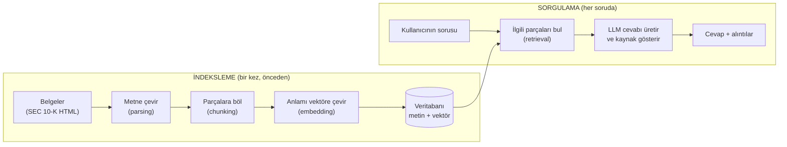

# Bölüm 1 — RAG Nedir?

> **Bu bölümde:** Büyük dil modellerinin (LLM) neden tek başına güvenilir bir "belge asistanı" olamadığını, RAG'in bu sorunu nasıl çözdüğünü ve Document Copilot'un büyük resmini göreceksin.

## 1.1 Bir benzetmeyle başlayalım: kapalı kitap ve açık kitap sınavı

Bir öğrenciyi düşün. Dönem boyunca çok şey okumuş, iyi de hatırlıyor. Kapalı kitap sınavına girdiğinde hafızasından cevap verir. Çoğu zaman doğru bilir, ama emin olmadığı bir soruda da boş bırakmaz; kulağa doğru gelen bir cevap uydurur. Hocanın "Bunu nereden biliyorsun?" sorusuna da cevabı yoktur.

Aynı öğrenci **açık kitap** sınavına girdiğinde farklı davranır. Önce soruyla ilgili sayfaları bulur, onları okur, cevabını o sayfalara dayanarak yazar ve kenarına "bkz. sayfa 23" diye not düşer. Kitapta olmayan bir şey sorulursa "kitapta bu yok" diyebilir.

**Büyük dil modelleri (LLM) varsayılan olarak kapalı kitap öğrencisidir. RAG, onları açık kitap öğrencisine dönüştürür.**

## 1.2 Dil modeli nedir, neyi bilir?

GPT, Claude gibi büyük dil modelleri, çok büyük miktarda metin üzerinde "bir sonraki kelimeyi tahmin etmek" için eğitilmiş sinir ağlarıdır. Eğitim sırasında gördükleri bilgiyi ağırlıklarında (parametrelerinde) sıkıştırılmış halde taşırlar. Bu yüzden:

1. **Bilgilerinin bir kesim tarihi vardır.** Eğitimden sonra yayınlanan bir raporu bilmezler.
2. **Özel belgeleri bilmezler.** Şirketinin iç dokümanları, müşterinin sözleşmeleri modelin eğitim verisinde yoktur.
3. **Uydurabilirler (halüsinasyon).** Model "bilmiyorum" demek yerine istatistiksel olarak makul görünen bir cevap üretebilir. Örneğin "Apple'ın 2024 iPhone geliri" sorusuna gerçek rakama yakın ama yanlış bir sayı verebilir.
4. **Kaynak gösteremezler.** Cevabın hangi belgenin hangi sayfasından geldiğini söyleyemezler, çünkü bilgi ağırlıklara dağılmıştır, bir sayfada durmaz.

Bir finans analisti için 3. ve 4. madde kabul edilemez. Yanlış bir rakam yanlış bir yatırım kararına yol açar. Kaynağı gösterilmeyen bir cevap da doğrulanamaz, dolayısıyla kullanılamaz.

## 1.3 "Belgeleri modele verelim" neden yetmez?

Akla gelen ilk çözüm şu: bütün belgeleri soruyla birlikte modele verelim. Buna **context window** (bağlam penceresi) denir; model bir seferde belli miktarda metni "görebilir".

Bizim projede 5 şirketin 5'er yıllık 10-K raporu var. Markdown'a çevrildiklerinde toplam yaklaşık **18 MB metin** ediyorlar, yani birkaç milyon token (token kavramını Bölüm 5'te açıklıyoruz). Bu hem pencereye sığmaz hem de sığsaydı bile her soru için milyonlarca token ödemek çok pahalı ve yavaş olurdu. Üstelik modeller çok uzun bağlamın ortasındaki bilgiyi gözden kaçırmaya meyillidir.

Demek ki gereken şey, **her soru için belgelerin yalnızca ilgili birkaç parçasını bulup modele vermek.** RAG tam olarak budur.

## 1.4 RAG: Retrieval-Augmented Generation

Terim 2020'de Facebook AI araştırmacılarının (Lewis ve ark.) makalesiyle yaygınlaştı. Üç kelimeden oluşur:

- **Retrieval (getirme):** Soruyla ilgili belge parçalarını bir arama sistemiyle bul.
- **Augmented (zenginleştirilmiş):** Bu parçaları modelin girdisine (prompt'una) ekle.
- **Generation (üretme):** Model cevabı bu parçalara dayanarak üretsin ve hangi parçayı kullandığını göstersin.

Açık kitap benzetmesiyle: *retrieval* sayfaları bulmak, *augmented* o sayfaları masaya açmak, *generation* cevabı yazmaktır.

## 1.5 İki evre: indeksleme ve sorgulama

Bir RAG sistemi iki ayrı zamanda çalışır:

**İndeksleme** bir kütüphaneyi düzenlemeye benzer: kitapları rafa dizersin, katalog kartları hazırlarsın. Yavaştır ama bir kez yapılır. Bizim projede 25 raporu indekslemek yaklaşık iki saat sürdü; o sürenin çoğu veritabanına yükleme zamanıydı.

**Sorgulama** bir okuyucunun kütüphaneye gelip soru sormasıdır. Katalog hazır olduğu için doğru rafı saniyeler içinde bulursun. Bizim arama sistemimiz bir soruya 5–10 saniyede on pasaj döndürüyor.

## 1.6 Document Copilot'ta RAG

Document Copilot, analistlerin SEC 10-K raporları hakkında soru sorduğu bir sohbet uygulaması. Ürünün temel sözü **güven**:

- Her cevap gerçekten getirilmiş pasajlara dayanmalı.
- Her iddianın bir kaynağı (şirket, rapor, yıl, sayfa, bölüm) olmalı.
- Kanıt yoksa sistem "raporlarda bunun için yeterli kanıt yok" diyebilmeli.

Bu yüzden projede "çalışıyor gibi görünmek" yetmez; her adımı ölçerek doğruladık (Bölüm 11).

Bu kitabın yazıldığı noktada projede şunlar tamamlandı:

| Adım | Durum | Bölüm |
|---|---|---|
| Belgeleri indirmek | ✅ | 2 |
| Metne çevirmek | ✅ | 3 |
| Tabloları temiz çıkarmak | ✅ | 4 |
| Chunking, sayfa, bölüm | ✅ | 5 |
| Embedding | ✅ | 6 |
| Vektör arama | ✅ | 7 |
| Tam metin arama | ✅ | 8 |
| Hibrit arama (RRF) | ✅ | 9 |
| LLM ile cevap üretme ve grounding | ⏳ Faz 6 | 12 |

Yani RAG'in "R"si (retrieval) bitti; "G"si (generation) sırada.

## 1.7 "Basit RAG" neden bizim için yetmedi?

İnternetteki çoğu RAG örneği şöyledir: "PDF'i oku, 500 karakterlik parçalara böl, her birini embed et, bir vektör veritabanına koy, en yakın 5 parçayı modele ver." Bu, blog yazıları gibi düz metinlerde iyi çalışır. Finansal raporlarda ise şu yüzden yetersiz kalır:

1. **Tablolar:** Rakamların çoğu tablolarda durur. Bir tabloyu rastgele 500 karakterden bölersen "201,183" sayısı "iPhone" ve "2024" etiketlerinden kopar ve anlamsızlaşır (Bölüm 4).
2. **Tam eşleşme gereken kelimeler:** "AWS", "Item 1A", "10-K" gibi terimleri anlamsal arama iyi yakalamaz, kelime araması gerekir (Bölüm 8).
3. **Kaynak bilgisi:** Alıntının hangi sayfadan ve bölümden geldiği bilinmeli. HTML'de sayfa kavramı olmadığı için bu bilgiyi kendimiz çıkarmamız gerekti (Bölüm 5).
4. **Filtreler:** "Sadece NVIDIA'nın 2025 raporunda ara" demek, vektör aramasında sanıldığı kadar kolay değil (Bölüm 7).

Kitabın geri kalanı bu sorunları tek tek ele alıyor.

## Özet

- LLM'ler özel ve güncel belgeleri bilmez, uydurabilir ve kaynak gösteremez.
- Bütün belgeleri modele vermek pahalı ve çoğu zaman imkânsızdır.
- RAG, her soru için ilgili parçaları bulur ve modelin cevabını bu parçalara dayandırır.
- Sistem iki evrede çalışır: önceden yapılan **indeksleme** ve her soruda yapılan **sorgulama**.
- Finansal raporlar; tablolar, tam eşleşme gerektiren terimler ve kaynak bilgisi yüzünden basit RAG'den fazlasını gerektirir.

## Kaynaklar

- Lewis ve ark. (2020), *Retrieval-Augmented Generation for Knowledge-Intensive NLP Tasks*: <https://arxiv.org/abs/2005.11401>
- Proje mimarisi: [`docs/architecture.md`](../architecture.md)
- Müşteri ihtiyaçları ve örnek sorular: [`docs/client-brief.md`](../client-brief.md)

---
Sonraki bölüm: [Kaynak veri: SEC 10-K raporları →](02-kaynak-veri.md)
