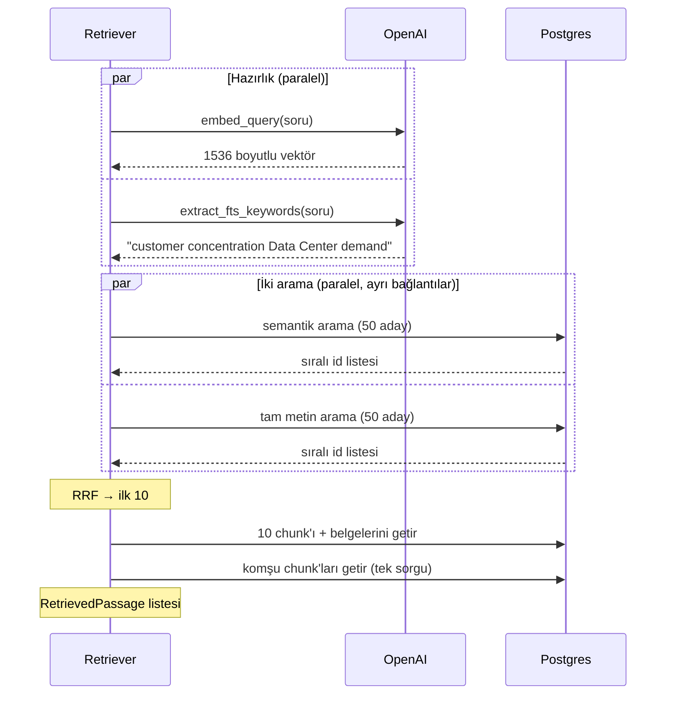

# Bölüm 9 — Hibrit Arama ve RRF

> **Bu bölümde:** Semantik ve tam metin aramayı neden birlikte kullandığımızı, iki sıralı listeyi **Reciprocal Rank Fusion (RRF)** ile nasıl birleştirdiğimizi ve bir sorunun, arama katmanının tamamından geçip on pasaja dönüşme yolculuğunu adım adım göreceğiz.

## 9.1 İki arama, iki güçlü yan

| | Semantik arama (embedding) | Tam metin arama (kelime) |
|---|---|---|
| Güçlü | Farklı kelimelerle ifade edilmiş aynı anlam ("telefon geliri" ↔ "iPhone net sales") | Tam terimler, kodlar, ürün adları ("AWS", "Item 1A", "Blackwell") |
| Zayıf | Nadir terimler, sayılar, kodlar | Eş anlamlılar, farklı ifade biçimleri |

Cookbook'taki özetle: kelime araması, sorgu ile belge **nadir bir terimi paylaştığında** kazanır ama sorgu başka kelimelerle ifade edilince çöker; semantik arama tam da orada kazanır. İkisini birleştirmek iki kazancı da yakalar. Cookbook'un FiQA ölçümlerinde (NDCG@10): kelime araması ≈ 0,24, semantik arama ≈ 0,31, ikisinin RRF ile birleşimi ≈ 0,35.

Buna **hibrit arama** diyoruz.

## 9.2 Puanları neden doğrudan toplayamayız?

İki arama iki farklı puan üretiyor:

- Semantik arama: kosinüs benzerliği, bizim verimizde ~0,5–0,8 arası.
- Tam metin arama: `ts_rank_cd`, ~0,1 ile 2 arası, üst sınırı yok.

Bu iki sayıyı toplamak, metreyle kilogramı toplamaya benzer. Ölçekler farklı olduğu için hangi aramanın büyük sayı ürettiği sonucu belirler. Cookbook'taki örnekte BM25 puanı 18,5'e çıkabildiği için, basit bir ortalamada kelime araması semantik aramayı ~25 kat baskılıyor.

## 9.3 Reciprocal Rank Fusion (RRF)

RRF'nin fikri çok zarif: **puanları at, sadece sıraya bak.** 2009'da Cormack, Clarke ve Büttcher tarafından önerildi. Formülü:

```text
RRF(belge) = Σ  1 / (k + sıra)
            her liste
```

- `sıra`: belgenin o listedeki yeri (1, 2, 3, …).
- `k`: bir yumuşatma sabiti, standart değeri **60**.
- Belge bir listede hiç yoksa o listeden puan almaz.

### Elle bir örnek

İki listemiz olsun:

| Belge | Semantik sıra | Tam metin sıra | RRF puanı |
|---|---|---|---|
| A | 1 | yok | 1/61 = 0,0164 |
| B | 2 | 1 | 1/62 + 1/61 = 0,0161 + 0,0164 = **0,0325** |
| C | 3 | 5 | 1/63 + 1/65 = 0,0159 + 0,0154 = **0,0313** |
| D | yok | 2 | 1/62 = 0,0161 |

Sonuç sırası: **B, C, A, D.** A semantik aramada birinci olmasına rağmen üçüncüye düştü; B ve C ise **iki aramada da** göründükleri için öne çıktı. RRF'nin temel sezgisi bu: **bağımsız iki yöntemin üzerinde uzlaştığı belge büyük ihtimalle gerçekten ilgilidir.**

### Neden k = 60?

`k` küçük olursa ilk sıralar çok ağır basar (1/1 ile 1/2 arasında büyük fark var). `k` büyük olursa bütün sıralar birbirine benzer. 60, ilk sıraların anlamlı ağırlık taşıdığı ama iki listedeki uzlaşmanın yine de büyük fark yarattığı bir orta nokta; makalede deneysel olarak iyi sonuç veren değer.

Bizim kodumuz tam olarak bu kadar kısa (`backend/app/retrieval/fusion.py`):

```python
def reciprocal_rank_fusion(rankings, *, k=60):
    scores = defaultdict(float)
    for ranking in rankings:
        for rank, chunk_id in enumerate(ranking, start=1):
            scores[chunk_id] += 1.0 / (k + rank)
    return sorted(scores.items(), key=lambda item: item[1], reverse=True)
```

Smoke testindeki gerçek puanlarımız da bunu gösteriyor: ~0,03 civarındaki puanlar iki listede de üst sıralarda olan pasajlar (1/61 + 1/62 ≈ 0,0325), ~0,016 civarındakiler ise yalnızca bir listeden gelenler.

## 9.4 Retriever: bir sorunun yolculuğu

`DocumentRetriever.search(soru, filters=...)` çağrıldığında olanlar:



### Adım 1: Paralel hazırlık

Sorunun embedding'i ile anahtar kelimelerin çıkarılması birbirinden bağımsız iki ağ çağrısı. Birini beklemeden ikisini aynı anda başlatıyoruz (`ThreadPoolExecutor`). Toplam süre, ikisinin toplamı değil, yavaş olanın süresi kadar.

### Adım 2: Paralel iki arama

Semantik ve tam metin araması da aynı anda çalışıyor. İnce bir nokta: SQLAlchemy'nin veritabanı oturumu (session) aynı anda iki thread'den kullanılamaz. Bu yüzden her arama kendi oturumunu açıyor.

Her arama **50 aday** (`retrieval_candidate_k`) döndürüyor. Neden 10 değil de 50? Çünkü füzyon, iki listenin kesişimini arıyor. Aday havuzu geniş olunca, bir aramada 30. sırada olan ama diğerinde 2. sırada olan bir pasaj da yakalanabiliyor.

### Adım 3: Füzyon

RRF ile iki liste birleşiyor, ilk **10** (`retrieval_top_k`) alınıyor.

### Adım 4: Pasajları doldurmak (hydrate)

Aramalar yalnızca id döndürdü. Şimdi bu 10 chunk'ın metnini, sayfasını, bölümünü ve ait olduğu belgenin bilgilerini tek sorguyla çekiyoruz.

### Adım 5: Komşular

Her sonucun bir önceki ve bir sonraki chunk'ı (`retrieval_neighbor_radius = 1`) bağlam olarak ekleniyor. "Bu artış…" diye başlayan bir pasajın öncesini görmek, cevabın doğruluğu için önemli. Bir komşu zaten sonuçlarda varsa ya da başka bir sonucun komşusu olarak eklendiyse tekrar eklenmiyor.

> **Performans notu.** Referans, her sonucun komşularını ayrı bir sorguyla çekiyor: 10 sonuç, 10 sorgu. Bizim veritabanımıza her gidiş-dönüş ~360 ms sürdüğü için bu, arama başına ~3,6 saniye demekti. Bütün komşuları tek bir sorguyla çekiyoruz (`get_neighbor_chunks`).

### Adım 6: Filtreler

`SearchFilters(ticker="NVDA", fiscal_years=[2025], form="10-K")` iki aramaya da aynı SQL koşulu olarak ekleniyor. Değerler SQL metnine gömülmüyor, parametre olarak bağlanıyor; bu, SQL enjeksiyonuna karşı standart korumadır. Semantik aramada filtrelerin neden özel bir önlem (iterative scan) gerektirdiğini Bölüm 7'de gördük.

### Adım 7: Agent için metin

`format_passages_for_agent`, pasajları dil modelinin okuyacağı sınırlı bir metne çeviriyor:

```text
NVDA 10-K FY2025 p.79 (Item 15. Exhibits and Financial Statement Schedules) [3f2a…]: Revenue by geographic area ...
  neighbor idx=611 [9b1c…]: ...
```

Her pasajın başında şirket, form, yıl, sayfa, bölüm ve **chunk id'si** var; dil modeli bu id'lerle alıntı yapacak (Bölüm 12). Pasaj başına 800, toplamda 12.000 karakter sınırı var; model gereksiz uzun bir girdiyle boğulmasın diye.

## 9.5 Ayarlar

Hepsi `backend/app/config.py`'de ve ortam değişkenleriyle değiştirilebiliyor:

| Ayar | Değer | Rolü |
|---|---|---|
| `retrieval_candidate_k` | 50 | Her aramanın füzyondan önce getirdiği aday sayısı |
| `retrieval_top_k` | 10 | Füzyondan sonra döndürülen pasaj sayısı |
| `retrieval_rrf_k` | 60 | RRF sabiti |
| `retrieval_neighbor_radius` | 1 | Her sonuca eklenen önceki/sonraki chunk sayısı |
| `retrieval_fts_keyword_model` | `gpt-4.1-mini` | Anahtar kelime modeli |
| `retrieval_fts_keyword_max` | 5 | Anahtar kelime bütçesi |

## 9.6 Bir sonraki seviye: reranking

Cookbook'ta hibrit aramadan sonra bir adım daha var: **cross-encoder ile yeniden sıralama (reranking)**. Embedding soruyu ve pasajı ayrı ayrı vektörlere çevirir. Bir reranker ise soru ile pasajı **birlikte** okuyup "bu pasaj bu soruyu cevaplıyor mu?" diye puanlar. Daha yavaş ve ücretli (cookbook Cohere'in reranker'ını kullanıyor), ama FiQA'da NDCG@10'u ≈ 0,35'ten ≈ 0,40'ın üzerine çıkarıyor. Referans projemizde bu adım yok; ileride kaliteyi artırmak için güçlü bir seçenek.

## Özet

- Semantik ve tam metin arama birbirinin zayıf yanını kapatır; hibrit arama ikisini birleştirir.
- Farklı ölçekteki puanlar doğrudan toplanamaz; RRF yalnızca sıraları kullanır: `Σ 1/(60 + sıra)`.
- İki aramada da görünen pasajlar öne çıkar; bu "uzlaşma", ilgililiğin güçlü bir işaretidir.
- Retriever: paralel hazırlık → paralel iki arama (50'şer aday) → RRF (ilk 10) → pasajlar → komşular → sınırlı agent metni.
- Uzak veritabanlarında gidiş-dönüş sayısını azaltmak ciddi süre kazandırır.

## Kaynaklar

- RRF makalesi, Cormack, Clarke ve Büttcher (SIGIR 2009): <https://plg.uwaterloo.ca/~gvcormac/cormacksigir09-rrf.pdf>
- Cookbook, hibrit arama öğreticisi ve RRF/reranking açıklamaları: <https://github.com/daveebbelaar/ai-cookbook/tree/main/knowledge/hybrid-retrieval>
- Kod: `backend/app/retrieval/retriever.py`, `fusion.py`, `types.py`, `backend/app/database/documents.py`

---
[← Tam metin arama](08-tam-metin-arama.md) · Sonraki bölüm: [Yükleme hattı ve veritabanı →](10-yukleme-hatti-ve-veritabani.md)
