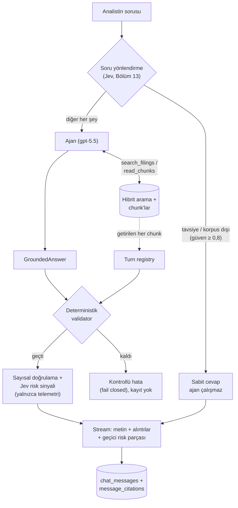

# Bölüm 12 — Cevap Üretmek ve Grounding

> **Bu bölümde:** RAG'in "G"si olan üretim (generation) aşamasını, bu projede gerçekten kurduğumuz haliyle göreceğiz. Dil modeline arama araçları veren bir **ajan**, cevabın biçimini sabitleyen **yapılandırılmış çıktı**, cevabın kaynaklara dayandığını kodla denetleyen **grounding katmanları** ve bunların hepsini ölçerken öğrendiklerimiz. Jev'i kullandığımız iki katman (soru yönlendirme ve risk sinyali) bir sonraki bölümün konusu.

## 12.1 Arama sonuçları cevap değildir

Bölüm 9'daki hibrit arama bir soruya 10 ilgili pasaj döndürüyor. Ama analist 10 pasaj değil, bir cevap istiyor: *"Apple'ın gelir dağılımında Services'in payı 2021'den 2025'e nasıl değişti?"* Bu cevap için pasajları okumak, birden çok yılın rakamlarını karşılaştırmak, sonucu açıkça yazmak ve **her iddianın hangi pasajdan geldiğini göstermek** gerekiyor. Bunu dil modeli yapıyor; bu bölüm, modelin bunu güvenilir biçimde yapması için etrafına kurduğumuz yapıyı anlatıyor.

## 12.2 Ajan: modele arama araçları vermek

Klasik RAG'de akış tek yönlüdür: soru → tek arama → pasajlar prompt'a → cevap. Bu, bizim sorularımız için yetmiyor. Smoke testinde gördüğümüz gibi, Apple'ın gelir tablosu sorusunda ilk sonuçlar tablonun dipnotlarıydı; asıl satırlar komşu chunk'lardaydı.

Bu yüzden **agentic RAG** kullanıyoruz: dil modeline (bizde `gpt-5.5`) arama **araçları** veriliyor, ne zaman ve ne ile arayacağına kendisi karar veriyor. Ajanı **PydanticAI** ile kurduk (`backend/app/assistant/agent.py`):

| Araç | Ne yapar | Ne döndürür |
|---|---|---|
| `search_filings(query, ticker, form, fiscal_years)` | Bölüm 9'daki hibrit aramayı çağırır | 10 pasaj + komşuları, her biri **800 karakterlik özet** |
| `read_chunks(chunk_ids)` | Birden çok chunk'ı tek seferde okur | Chunk'ların **tam metni** |
| `read_chunk(chunk_id)` | Tek bir chunk'ı okur | Tam metin |
| `read_surrounding_chunks(chunk_id, radius)` | Bir chunk'ın öncesini ve sonrasını okur | Tam metin, sırasıyla |

**Özet mi, tam metin mi?** Referans projede okuma araçları da metni 800 karakterde kesiyordu. Ölçtük: düz metin chunk'larının **%70,7'si** 800 karakterden uzun. Model görmediği metni alıntılayamayacağı için okuma araçları tam metin döndürüyor; arama sonuçları ise özet kalıyor. Bu, "arama kısa parça, okuma tam belge" şeklindeki yaygın uygulama. Toplam çıktı yine 12.000 karakterle sınırlı; sığmayan chunk ortadan kesilmiyor, id'si listelenip ayrı okunması isteniyor.

**Turn registry: alıntı izin listesi.** Araçların bu mesajda döndürdüğü her chunk (komşular dahil) bir kayıt defterine (`TurnRegistry`) yazılıyor. Cevap **yalnızca** bu chunk'ları alıntılayabilir; model hafızasından ya da başka bir mesajdan bir chunk uyduramaz (`backend/app/assistant/deps.py`).

## 12.3 Yapılandırılmış çıktı: `GroundedAnswer`

Model serbest metin döndürmüyor; PydanticAI ona tipli bir nesne döndürtüyor:

```python
class Citation(BaseModel):
    citation_index: int     # metindeki [n]
    chunk_id: UUID          # alıntılanan chunk
    excerpt: str            # o chunk'tan birebir kopyalanan metin

class GroundedAnswer(BaseModel):
    answer: str                        # "[1]", "[2]" işaretli cevap metni
    citations: list[Citation]
    insufficient_evidence: bool = False
```

Çıktının şekli garanti olduğu için cevabı metin olarak ayrıştırmaya çalışmıyoruz; her alıntının hangi chunk'a işaret ettiği kesin (`backend/app/assistant/outputs.py`).

## 12.4 Ürün sözleşmesi: talimatlar

Modelin kuralları ayrı bir dosyada duruyor (`backend/app/assistant/instructions.md`): yalnızca araçlardan gelen pasajlara dayan, her iddiaya `[n]` koy, kanıt yoksa "yeterli kanıt yok" de ve alıntı koyma, yatırım tavsiyesi verme, raporların söylemediği nedenselliği kurma.

Bu dosya ölçtükçe büyüdü. Aşağıdaki kuralların her biri gerçek bir hatadan doğdu:

| Kural | Hangi ölçümden |
|---|---|
| Korpusta yalnızca 5 şirketin 10-K'ları var; 10-Q yok | Model olmayan bir 10-Q'yu filtreleyip boş sonuç almasın diye |
| Alıntıya araç çıktısındaki başlık satırı (`AAPL 10-K FY2024 p.23 … [id]:`) konmaz | gpt-5-mini 10 cevabın 5'inde bunu yaptı |
| Alıntı kısa olur, içinden kelime atılmaz; iki ayrı yer için iki alıntı | gpt-5.5, 773–2.202 karakterlik alıntıların ortasından cümle attı |
| Yıl belirtilmemişse en güncel yıl kullanılır ve söylenir | gpt-5-mini "Apple'ın geliri?" sorusuna FY2025 yerine FY2024'ü, yıl belirtmeden verdi |
| Geniş sorularda bulunan kanıtla kısmi cevap verilir | Çok şirketli iki soru 200 bin token sınırına takıldı |

## 12.5 Bir mesajın yolculuğu



Kod tarafında bu akışın sahibi `backend/app/chat/orchestrator.py`. Birkaç ayrıntı:

- Ajan çalışırken "Searching SEC filings…" gibi **durum mesajları** geçici (`transient`) parçalar olarak akıyor; mesaj geçmişine girmiyorlar. Kullanıcı ilk saniyeden itibaren sistemin ne yaptığını görüyor.
- Cevap tamamen hazır olmadan akış başlamıyor: önce doğrulanıyor, sonra kelime kelime akıyor. Doğrulanmamış bir cevabın yarısını göstermek istemiyoruz.
- Kullanıcı ajan çalışırken sayfayı kapatırsa ajan iptal ediliyor; para harcamaya devam etmiyor.
- Alıntılar `data-citation` parçaları olarak gidiyor ve `message_citations` tablosuna **bu parçalardan** yazılıyor; ekranda görülenle kaydedilen hiçbir zaman ayrışmıyor.

## 12.6 Grounding katmanı 1: deterministik validator

Modele "yalnızca pasajlara dayan" demek bir **rica**. Grounding'i bir **kurala** çeviren şey kod: `backend/app/grounding/validator.py`. LLM çağırmaz, her seferinde aynı sonucu verir, milisaniyeler sürer.

| Kontrol | Hata kodu |
|---|---|
| Cevap boş mu? | `empty_answer` |
| Alıntısız cevap "kanıt yetersiz" olarak işaretlenmiş mi? | `missing_citations` |
| "Kanıt yetersiz" dediği halde alıntı var mı? | `insufficient_evidence_with_citations` |
| Metindeki her `[n]` bir alıntıya, her alıntı bir `[n]`'e karşılık geliyor mu? | `marker_without_citation`, `citation_not_referenced` |
| Numaralar 1'den başlayıp boşluksuz mu? | `duplicate_citation_index`, `citation_indices_not_contiguous` |
| Alıntılanan chunk bu mesajda getirilmiş mi (turn registry)? | `chunk_not_retrieved` |
| Alıntı metni o chunk'ta **birebir** geçiyor mu? | `excerpt_not_in_chunk` |
| Alıntı anlamlı uzunlukta mı (en az 12 karakter)? | `excerpt_too_short` |
| İşaretsiz bir satırda para tutarı ya da yüzde var mı? | `uncited_figure` |

**Birebir ama akıllıca.** "Birebir" karşılaştırmadan önce anlamı değiştirmeyen farklar eşitleniyor: boşluklar, Unicode biçimleri, kıvrık tırnaklar, tire türevleri ve Markdown tablo işaretleri (`|`, `|---|`). Kelimeler ve rakamlar ise sırasıyla aynı olmak zorunda. Bu kuralların ikisi farklı bir modelle test ederken bulundu: `gpt-oss` her tireyi U+2011 (bölünmez tire) olarak yazıyordu ve kelimesi kelimesine doğru alıntılar reddediliyordu. Hiç hata yapmayan bir modelle bu açığı hiç görmezdik.

**Fail closed.** Bir kural bozulursa cevap gösterilmiyor ve kaydedilmiyor; kullanıcı "cevabı kaynaklarla doğrulayamadım" mesajı görüyor. Kötü görünen bir hata, iyi görünen ama desteksiz bir cevaptan iyidir.

## 12.7 Grounding katmanı 2: sayısal doğrulama

Finansal cevaplarda en tehlikeli hata yanlış rakam. Validator alıntının kaynakta geçtiğini kanıtlıyor, ama cevap metnindeki rakamın alıntıyla tutup tutmadığına bakmıyor. Bunu `backend/app/grounding/numeric.py` yapıyor: cevaptaki her finansal rakamı, alıntılanan kaynaklardaki sayılarla kodla karşılaştırıyor.

| Sonuç | Anlamı | Örnek |
|---|---|---|
| `exact` | Aynı sayı kaynakta var | Cevap "$24,967", kaynak "24,967" |
| `scaled` | Birimi dönüştürülmüş hali var | Cevap "$25.0B", kaynak tablo milyon cinsinden "24,967" |
| `derived` | İki kaynak sayısından hesaplanabiliyor | Marj "%6,4" = 24.967 / 387.497; büyüme; tamamlayıcı pay (%48 → %52) |
| `unverified` | Hiçbiri tutmuyor | Değiştirilmiş rakam |

Tam sayı yüzdeler (ör. "%6") "hesaplanmış" sayılmıyor: kaynakta onlarca sayı varken rastgele iki sayının oranı bir tam sayıyı kolayca tutturur. Bu katman **cevabı engellemiyor**, yalnızca uyarı üretiyor; çünkü doğru bir cevap da rakamı bizim kuralımızın tanımadığı bir biçimde yazabilir.

Ölçülen etkisi: rakamı değiştirilmiş 17 sahte iddianın 15'ini tek başına, Jev'e hiç ihtiyaç duymadan yakaladı. Bir iddia yaklaşık 0,2 ms sürüyor.

## 12.8 Güvenlik limitleri ve maliyetin anatomisi

Her mesajın ajan çalıştırması şu sınırlarla korunuyor (`backend/app/config.py`): en fazla 20 model isteği, 15 araç çağrısı, 100 bin toplam token, 20 bin çıktı token'ı ve tek cevap başına 12 bin çıktı token'ı. Sınıra takılan bir çalıştırma cevap üretmeden duruyor; maliyet kontrolden çıkmıyor.

**Bir soru neden 40–170 bin token tutuyor?** Soru tek cümle; ama ajan cevaba ulaşmak için modele 5–10 istek atıyor ve **her istekte o ana kadarki konuşmanın tamamı yeniden gönderiliyor**: talimatlar ve araç şemaları (~1.400 token), her arama sonucu (~3.000 token), her okuma. Q1'de en büyük tek istek 10.669 token'dı ama 6 isteğin toplamı 36.524 token etti.

**Önbellek bunu ucuzlatıyor.** Tekrar gönderilen baştaki kısmı OpenAI önbellekten okuyor ve 10 kat ucuza sayıyor; ölçümlerimizde girdinin %55–79'u böyle okundu.

**Maliyetin çoğu çıktıdan.** `gpt-5.5`'te çıktı token'ı girdiden 6 kat pahalı ($30'a karşı $5, milyon token başına). Q1'in $0,216'lık maliyetinin $0,130'u 4.327 çıktı token'ından geldi; bunun ~%40'ı modelin kendi içinde yaptığı, bizim görmediğimiz düşünme (reasoning) token'ları.

## 12.9 Ölçerek öğrendiklerimiz

**Müşteri brifindeki 10 soru (gpt-5.5):** 6'sı doğrulamadan geçti. İkisi reddedildi; üç alıntının üçünde de model uzun alıntının ortasından bir cümle ya da ifade atmıştı, yani red doğruydu. İkisi 200 bin token sınırına takıldı. Elle kontrol edilen rakamların hepsi doğruydu: Q1'deki 25 gelir payı ve Q2'deki 15 segment marjı, veritabanındaki tablolarla birebir. Soru başına $0,22–0,43, 60–100 saniye.

**Ücretsiz modeller:** Ollama'daki `gpt-oss:120b` ve `nemotron-3-super` her turda tek araç çağırdı, aynı aramaları tekrarladı ve 250 bin token'da bile cevap üretemedi. Küçük bir testle bunun API'nin değil modelin davranışı olduğunu gördük: aynı API'de Nemotron paralel araç çağırabiliyordu. Gemini'nin ücretsiz modelleri yoğunluk hatası (503) verdi; Groq'un ücretsiz katmanı dakikada 8 bin token ile tek bir isteği bile taşımıyordu.

**Ucuz modeller ("basit" sorular için):** `gpt-4.1-mini` 15 sorunun 11'ini, `gpt-5-mini` 8'ini doğrulamadan geçirdi. Ama iki riskli davranış görüldü: yıl belirtilmemiş bir soruya eski yılın rakamını yıl belirtmeden vermek ve doğru sonuca ilgisiz bir alıntıyla varmak. Bu yüzden ucuz model kullanılmadı; bulunan hatalar talimata kural olarak eklendi (12.4).

**Ders:** "Ucuz model = ucuz cevap" değil. Araçları verimsiz kullanan bir model token fiyatı düşük olsa da token sayısını katlayarak büyütüyor.

## 12.10 Kör noktalar

Katmanlarımız neyi yakalayamıyor? Ölçümlerde iki tür gördük:

1. **Birebir doğru ama soruyla ilgisiz alıntı.** Model "Amazon temettü ödemiyor" sonucuna, yöneticilerin hisse satış planından bahseden bir pasajı alıntılayarak vardı. Alıntı kaynakta birebir var (validator geçer), rakam yok (sayısal katman bir şey demez).
2. **Yanlış yıl.** FY2024 sorusuna FY2023 satırından doğru bir alıntıyla cevap vermek. Alıntı birebir doğru, rakam kaynakta var, kaynak iddiayı gerçekten destekliyor; hiçbir katman **cevabın soruyla örtüşüp örtüşmediğine** bakmıyor.

Bu yüzden arayüzdeki alıntı paneli önemli: analist her iddianın arkasındaki metni tek tıkla görebiliyor. Güvenin son katmanı hâlâ insan.

## Özet

- Ajan, arama araçlarını kendisi kullanıyor; arama özet, okuma tam metin döndürüyor ve alıntı yalnızca bu mesajda getirilen chunk'lardan yapılabiliyor.
- Cevap tipli bir nesne: metin, `[n]` alıntıları ve "kanıt yetersiz" bayrağı.
- Deterministik validator alıntı bütünlüğünü kodla denetliyor ve bozuk cevabı göstermiyor (fail closed); sayısal doğrulama rakamları birim dönüşümü ve hesaplamalarla birlikte kontrol edip uyarı üretiyor.
- Talimat dosyasındaki kuralların çoğu ölçümlerde görülen gerçek hatalardan doğdu.
- Maliyetin çoğu çıktı ve reasoning token'larından; girdi, her istekte konuşmanın yeniden gönderilmesi yüzünden büyüyor ve önbellek bunu ucuzlatıyor.
- Kör noktalar: soruyla ilgisiz ama birebir doğru alıntı ve yanlış yıl.

## Kaynaklar

- PydanticAI: <https://ai.pydantic.dev/>
- Cookbook, agentic RAG örneği: <https://github.com/daveebbelaar/ai-cookbook/tree/main/knowledge/agentic-rag>
- OpenAI fiyatları ve prompt önbelleği: <https://developers.openai.com/api/docs/pricing>
- Kod: `backend/app/assistant/`, `backend/app/grounding/`, `backend/app/chat/orchestrator.py`, `backend/scripts/smoke_assistant.py`

---
[← Kaliteyi ölçmek](11-kaliteyi-olcmek.md) · Sonraki bölüm: [Jev: tipli kararlar →](13-jev-tipli-kararlar.md)
