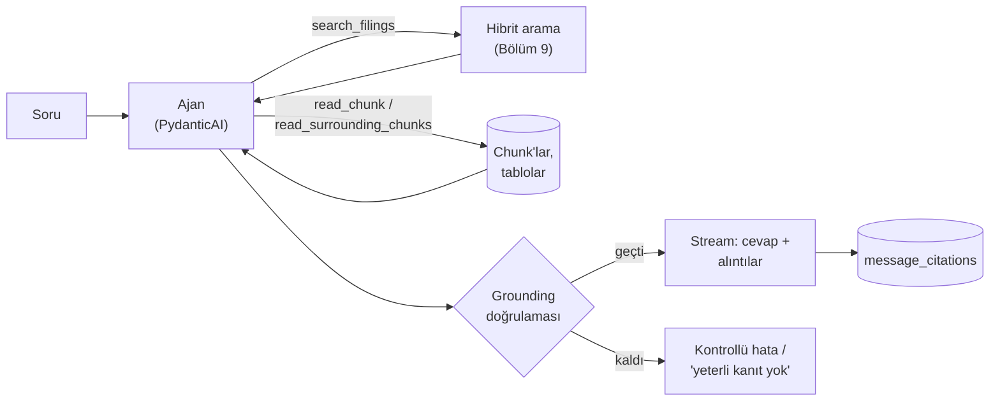

# Bölüm 12 — Sıradaki Adım: Cevap Üretmek ve Grounding

> **Bu bölümde:** RAG'in "G"si olan üretim (generation) aşamasını kavramsal olarak göreceğiz: arama sonuçları bir dil modeline nasıl verilir, model aramayı kendisi nasıl yönetebilir (agentic RAG) ve cevabın gerçekten kaynaklara dayandığı nasıl **garanti** edilir (grounding)?
>
> ⏳ Bu bölüm **Faz 6'nın önizlemesidir**. Burada anlatılanlar henüz kodlanmadı; referans projenin ve `docs/architecture.md`'nin tarif ettiği tasarımı anlatıyor.

## 12.1 Arama sonuçları cevap değildir

Şu ana kadar kurduğumuz sistem bir soruya 10 ilgili pasaj döndürüyor. Ama analist 10 pasaj değil, **bir cevap** istiyor: "Apple'ın gelir dağılımında Services'in payı 2021'den 2025'e nasıl değişti?" Bu cevabı üretmek için:

1. İlgili pasajları okumak,
2. Birden çok yıldan rakamları karşılaştırmak,
3. Sonucu açık bir dille yazmak,
4. Her iddianın hangi pasajdan geldiğini göstermek gerekiyor.

Bu, dil modelinin işi.

## 12.2 En basit hali: pasajları prompt'a koymak

Klasik RAG'de akış tektir: soru → arama → pasajları prompt'a ekle → model cevaplasın. Prompt kabaca şöyle görünür:

```text
Sistem: Sadece aşağıdaki pasajlara dayanarak cevap ver. Her iddiadan sonra pasaj id'sini yaz.
        Pasajlar yeterli değilse "yeterli kanıt yok" de.

Pasajlar:
[3f2a…] AAPL 10-K FY2024 p.23 (Item 7): The following table shows net sales by category...
[9b1c…] AAPL 10-K FY2021 p.21 (Item 7): ...

Soru: Services'in payı nasıl değişti?
```

Bölüm 9'daki `format_passages_for_agent` fonksiyonu, pasajları tam olarak bu biçime getirmek için var: her pasajın başında şirket, yıl, sayfa, bölüm ve alıntıda kullanılacak id bulunuyor.

## 12.3 Agentic RAG: aramayı modele bırakmak

Tek bir arama her zaman yeterli değildir. Smoke testinde gördük: Apple'ın gelir dağılımı sorusunda ilk sonuçlar tablonun dipnotlarıydı, asıl tablo satırları daha aşağıdaydı. Microsoft capex sorusunda da vergi ve borç pasajları öne çıktı.

**Agentic RAG**'de dil modeli bir "ajan" gibi davranır. Ona arama **araçları** verilir, ve ne zaman, ne ile arayacağına kendisi karar verir. Cookbook'taki agentic RAG örneğinin tarifiyle: model kaynakları doğrudan arar, sırada neyi okuyacağına karar verir, belgeler arasındaki ipuçlarını takip eder ve **ancak yeterli kanıtı olduğunda** cevap verir.

Referans projede planlanan araçlar:

| Araç | Ne yapar |
|---|---|
| `search_filings(sorgu, filtreler)` | Bizim hibrit aramamızı çağırır (Bölüm 9) |
| `read_chunk(chunk_id)` | Bir pasajın tamamını getirir |
| `read_surrounding_chunks(chunk_id)` | Bir pasajın öncesini ve sonrasını getirir |

Böylece model örneğin önce "Apple net sales by category" diye arar, bulamadığı yılı için filtreyi değiştirip tekrar arar, bir tablonun devamı için komşu chunk'ları okur.

Referans proje bunun için **PydanticAI** kullanıyor. Pydantic modelleriyle ajanın bağımlılıkları (`DocumentAgentDeps`: kullanıcı, retriever…) ve çıktısı (`GroundedAnswer`: cevap metni ve alıntılar) **tiplendiriliyor**. Çıktının şekli garanti altında olduğu için, cevabı metin olarak ayrıştırmaya çalışmak gerekmiyor.

## 12.4 Grounding: "kaynağa dayandırma"nın garantisi

Modele "sadece pasajlara dayan" demek bir **rica**dır, garanti değildir. Model yine de:

- Pasajlarda olmayan bir sayı yazabilir,
- Var olmayan bir pasaj id'si uydurabilir,
- Bir pasajı, aslında söylemediği bir şey için kaynak gösterebilir.

Bu yüzden Document Copilot'un mimarisinde grounding, bir istem (prompt) tercihi değil, **kodla uygulanan bir kural**. Planlanan `grounding/validator.py` şunları kontrol edecek:

1. Cevapta en az bir alıntı var, ya da cevap açıkça "yeterli kanıt yok" diyor.
2. Her alıntı, **bu soru için gerçekten getirilmiş** bir pasaja karşılık geliyor; model başka bir pasajı alıntılayamaz.
3. Alıntılar, arayüzün gösterebileceği bilgileri taşıyor: şirket, rapor, tarih, sayfa, bölüm ve alıntı metni.
4. Kontrol başarısız olursa sistem **kontrollü bir hata** döndürüyor; uydurulmuş ama iyi görünen bir cevap göstermiyor ("fail closed").

Bu, ürünün temel sözünün teknik karşılığı: **her iddia doğrulanabilir olmalı.**

## 12.5 "Bilmiyorum" diyebilmek

Müşteri brifindeki 10. soru bilerek zor seçilmiş: *"Raporlar, üretken yapay zekânın bu şirketlerden herhangi birinin marjlarını iyileştirdiğini kanıtlıyor mu?"* Raporlar yapay zekâya yapılan yatırımlardan ve genel marj değişimlerinden bahsediyor, ama "marj **şu yüzden** arttı" diye bir nedensellik kurmuyor. Doğru cevap, bulunan kanıtı göstermek ve **raporların ötesinde çıkarım yapmayı reddetmek**. İyi bir RAG sistemi, cevap verdiği kadar cevap vermediği yerde de güvenilirdir.

## 12.6 Alıntıların kaydı ve arayüz

Cevap üretildikten sonra:

- Metin, AI SDK stream protokolüyle kelime kelime kullanıcıya akar (Faz 3'te kurduk).
- Alıntılar, stream'de ayrı yapılandırılmış parçalar olarak gönderilir.
- Alıntılar `message_citations` tablosuna, pasaj metninin ve belge bilgisinin bir kopyasıyla kaydedilir (Bölüm 10).
- Faz 7'de arayüz her alıntıyı tıklanabilir bir etiket olarak gösterecek. Tıklayınca kaynak pasaj, ve tablo satırıysa tablonun tamamı (`document_tables`) açılacak.

## 12.7 Büyük resmin tamamı



Bu kitapta anlatılan her şey (parsing, tablolar, chunking, sayfa/bölüm, embedding, hibrit arama) bu akıştaki "Hibrit arama" kutusunu ve arkasındaki veriyi oluşturuyor. Faz 6'da onun etrafına ajanı ve grounding'i kuracağız.

## Özet

- Arama sonuçları cevap değildir; cevabı dil modeli pasajlara dayanarak üretir.
- Agentic RAG'de model arama araçlarını kendisi kullanır, gerekirse birden çok kez arar ve yeterli kanıt olunca cevap verir.
- Grounding, istemle değil kodla uygulanır: her alıntı getirilmiş bir pasaja dayanmalıdır; dayanmıyorsa sistem kontrollü şekilde başarısız olur.
- "Yeterli kanıt yok" demek, güvenilir bir sistemin özelliğidir.

## Kaynaklar

- Cookbook, agentic RAG örneği: <https://github.com/daveebbelaar/ai-cookbook/tree/main/knowledge/agentic-rag>
- PydanticAI: <https://ai.pydantic.dev/>
- Proje mimarisi (Backend LLM Layer, Grounding and Citation Policy): [`docs/architecture.md`](../architecture.md)

---
[← Kaliteyi ölçmek](11-kaliteyi-olcmek.md) · [Sözlük →](sozluk.md)
