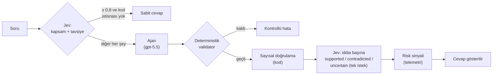

# Bölüm 13 — Jev: Tipli Kararlar, Risk Sinyali ve Soru Yönlendirme

> **Bu bölümde:** TypeSafe AI'ın Jev modelini tanıyacağız: metin üretmeyen, yalnızca **tipli kararlar** veren bir model. Onu RAG sistemimizde iki yerde kullandık: cevabı doğruladıktan sonra bir **risk sinyali** olarak ve soru ajana gitmeden önce bir **yönlendirici** olarak. Her iki kullanımın tasarımını, ölçüm sonuçlarını ve Jev'in asıl güçlü olduğu işi göreceğiz.

## 13.1 Başlangıç sorusu: LLM hakemi

Bölüm 12'deki deterministik validator bir alıntının kaynakta **birebir geçtiğini** kanıtlar, ama kaynağın iddiayı **anlamca desteklediğini** kanıtlamaz. Kaynak "gelir arttı" derken cevap "gelir düştü [1]" yazıp aynı cümleyi alıntılayabilir.

Bu boşluğu kapatmak için yaygın fikir bir **LLM hakemi**: cevap yazıldıktan sonra ikinci bir modele "bu kaynak bu iddiayı destekliyor mu?" diye sormak. Referans proje bunu `gpt-4.1-mini` ile yapıyor ve hakem "hayır" derse cevabı engelliyor.

Bizim yaklaşımımız farklı: Jev'i cevabı **engelleyen** bir hakem olarak değil, yalnızca bir **risk sinyali** olarak kullanıyoruz. Cevabın gösterilip gösterilmeyeceğine hâlâ yalnızca deterministik validator karar veriyor.

## 13.2 Jev nedir?

Jev, TypeSafe AI'ın "System One" dediği bir model sınıfının ilk örneği. Sohbet eden bir dil modeli değil; bir **durum** (`state`) ve **tipli sorular** alıyor, her soruya bir tip içinde cevap veriyor. Serbest metin üretmiyor.

| Soru tipi | Ne döndürür | Bizde nerede |
|---|---|---|
| `choice` | Tanımladığın seçeneklerden birini, her seçeneğin olasılığını ve bir güven değerini | İddia–kaynak ilişkisi, sorunun kapsamı |
| `noul` | Bir evet/hayır sorusunda "evet" olasılığını (0–1) | Yatırım tavsiyesi istiyor mu? |
| `score` | Sıralı bir ölçekte puan | Kullanmadık |

Bir istek ve cevabı kabaca şöyle:

```json
// istek
{"model": "jev-latest",
 "state": {"claim": "NVIDIA's gross margin decreased to 75.0%", "sources": {"S1": "Gross margins increased to 75.0% ..."}},
 "questions": {"c1": {"type": "choice", "instructions": "How do the sources relate to the claim?",
                      "criteria": {"supported": "...", "contradicted": "...", "uncertain": "..."}}}}
// cevap
{"answers": {"c1": {"choice": "contradicted", "confidence": 1.0,
                    "probabilities": {"supported": 0.0, "contradicted": 1.0, "uncertain": 0.0}}},
 "usage": {"input_tokens": 480}}
```

Pratik özellikleri: girdi milyon token başına $0,042, çıktı ücretsiz (bizim ölçümlerimizde bir iddia yaklaşık $0,00002); bir istek 0,3–1 saniye; bağlam penceresi 32 bin token. **Aynı `state` üzerinde birden çok soru** tek istekte, paralel ve birbirinden bağımsız cevaplanıyor.

"Halüsinasyon yapamaz" iddiası dikkatle okunmalı: Jev tanımlı seçenekler dışında bir şey söyleyemez, ama **yanlış seçeneği** seçebilir. Hakemde önemli olan da kararın doğruluğu.

## 13.3 Risk sinyali: cevap doğrulandıktan sonra

Tasarımın ilkesi: **Jev'i zayıf olduğu işte kullanma; o işi kodla yap, Jev'i yalnızca kalan kısım için kullan.** Ön testlerde iki zayıflık gördük: bir cümleyi o cümlede alıntılanan kaynaklardan yalnızca biriyle sorunca Jev "bu kaynak bunların çoğundan bahsetmiyor" diyor; birimi dönüştürülmüş ya da hesaplanmış rakamları (cevapta "$25.0B / 6.4%", kaynak tabloda milyon cinsinden 24.967 ve 387.497) kaynağa bağlayamıyor. Tasarım buna göre üç karar içeriyor:

1. **İddia = cümle ya da tablo satırı**, o satırdaki **tüm** kaynaklarla birlikte. Tablo satırlarına sütun başlıkları bağlam olarak ekleniyor; Jev hangi sayının hangi segmente ait olduğunu bilsin diye (`backend/app/grounding/claims.py`).
2. **Rakamlar kodda.** Bölüm 12.7'deki sayısal doğrulama birim dönüşümünü ve hesaplanmış yüzdeleri tanıyor. Jev "belirsiz" dediğinde, iddiadaki her rakam kodla doğrulanmışsa Jev'in şüphesi yok sayılıyor. "Çelişiyor" kararı ise asla bu yolla bastırılmıyor.
3. **Tek istek, çok soru.** Bir cevabın bütün iddiaları tek istekte gidiyor; kaynak metinleri `state` içinde bir kez yer alıyor ve her iddia ayrı bir soru oluyor (`judge_claims`, `backend/app/grounding/judge.py`).

Jev'in kararı bir **risk seviyesine** çevriliyor (`backend/app/grounding/risk.py`):

| Jev'in kararı | Güven | Risk |
|---|---|---|
| herhangi | < 0,5 | yok sayılır |
| `contradicted` | 0,5–0,8 | uyarı |
| `contradicted` | ≥ 0,8 | **yüksek risk** |
| `uncertain` | ≥ 0,5 | uyarı (rakamların hepsi kodla doğrulandıysa yok sayılır) |
| — | — | kodla doğrulanamayan rakam: uyarı |

**Hiçbir satır cevabı engellemiyor.** Sonuç log'a (`grounding_risk`), `TurnOutcome.risk`'e ve arayüze geçici bir veri parçası olarak gidiyor. Jev'e ulaşılamazsa ya da 10 saniyede cevap vermezse yalnızca bir not düşülüyor; anahtar tanımlı değilse Jev hiç çağrılmıyor.

**Nasıl ölçtük?** Etiketli verimiz olmadığı için **sentetik negatifler** kullandık: gpt-5.5'in doğrulanmış 4 cevabındaki 21 gerçek iddia (doğru cevap: sinyal yok) ve bunlardan kodla bozulmuş kopyalar: rakamı değiştirilmiş, yönü ters çevrilmiş ("increased" → "decreased") ya da başka bir şirketin kaynağıyla eşleştirilmiş (doğru cevap: işaretlenmeli).

**Sonuç (68 vaka):**

| | Toplu istek (kullanılan) | İddia başına ayrı istek |
|---|---|---|
| Gerçek iddialarda yanlış alarm | **0/21** | — |
| Bozuk örneklerin işaretlenmesi | 40/47 | 41/47 |
| Jev'in gerçek iddiaları desteklemesi | **21/21** | 18/21 |
| İstek sayısı | **16** | 68 |
| Girdi token'ı | **58.398** | 79.864 |
| Tek isteğin süresi (medyan) | **0,69 sn** | 0,83 sn |

Bozuk örneklerin kırılımı: alakasız kaynak 21/21, değiştirilmiş rakam 16/17 (15'ini sayısal katman tek başına yakaladı), ters çevrilmiş yön 3/9. Bir mesaja maliyeti ~$0,00015 ve ~0,7 saniye.

**Dürüst değerlendirme.** Bu tasarımda asıl işi sayısal doğrulama yapıyor. Jev'in kodla yapılamayan katkısı yön ve anlam çelişkileri, ama orada yakalama oranı düşük (3/9): uzun, çok olgulu iddialarda ters çevrilen kelime cümlenin ikincil bir kısmında kalınca Jev düşük güvenle karar veriyor. Ayrıca gerçek kullanımda gördüğümüz iki kör noktayı (Bölüm 12.10: ilgisiz ama birebir doğru alıntı, yanlış yıl) Jev de işaretlemedi. Bu yüzden risk sinyali telemetri olarak açık; kalıp kalmayacağına gerçek kullanım verisi karar verecek.

## 13.4 Jev'in güçlü olduğu yer: soru yönlendirme

Fintech'te Jev kullanımı üzerine bir yazıdaki (kaynaklarda) tespit bizimkiyle örtüştü: Jev **ön eleme ve yönlendirme** gibi kısa, az seçenekli kararlarda güçlü; **kanıt sentezi** gerektiren işte zayıf. İddia–kaynak doğrulaması ikinci türe yakın. Bu yüzden Jev'i bir de ajandan **önceye** koyduk (`backend/app/assistant/router.py`).

Soru gpt-5.5'e gitmeden Jev'e tek istekte iki soru soruluyor:

- `scope` (`choice`): korpus içinde mi (`in_corpus`), başka şirket mi, kapsam dışı yıl mı, raporların içeremeyeceği bir şey mi (hisse fiyatı, tahmin, haber)?
- `advice` (`noul`): yatırım tavsiyesi, hisse seçimi ya da hedef fiyat istiyor mu?

**Karar kodda, Jev'de değil.** Yazıdaki "politika motoru" önerisinin karşılığı:

1. Tavsiye olasılığı ≥ 0,8 → sabit bir ret cevabı, ajan çalışmaz.
2. Kapsam dışı ve güven ≥ 0,8 → sabit "bu raporlarla cevaplayamam" cevabı, ajan çalışmaz.
3. **Deterministik istisna:** Jev "başka şirket" dese bile soruda korpustaki bir şirketin adı ya da ticker'ı geçiyorsa soru engellenmez. "Apple ile Samsung'u karşılaştır" sorusunun Apple kısmı cevaplanabilir.
4. Geri kalan her şey, Jev hatası ya da 2 saniyelik zaman aşımı dahil, ajana gider; yani bugünkü davranış.

**Eşik neden 0,8?** Hataların bedeli asimetrik. Yanlış bir kısa yol meşru bir soruyu reddeder; yanlış bir ajan çağrısı ise yalnızca ~$0,3 fazla para demek. Emin olunamayan her soru ajana gidiyor.

**Sonuç (48 soruluk benchmark, iki çalıştırma):**

| Metrik | Sonuç |
|---|---|
| Korpus içi bir sorunun yanlışlıkla engellenmesi (kritik) | **0/25** |
| Beklenen karara tam uyum | 46/48 |
| Kapsam dışı ve tavsiye sorularının doğru engellenmesi | 18/20 (kaçan 2'si ajana gitti) |
| İki çalıştırmada aynı karar | 48/48 birincil karar |
| Soru başına maliyet / süre | ~$0,00003 / 0,3–0,9 sn |

Uygulamada: "Should I buy NVIDIA stock?" ve "What was Tesla's revenue in 2024?" soruları 0,4 saniyede cevaplanıyor; ajan çalışsaydı her biri ~$0,3 ve ~60 saniye tutacaktı.

Bir de yapmadığımız şey var: Jev'e sorunun "basit mi karmaşık mı" olduğunu da sorup basit soruları ucuz modele göndermeyi ölçtük. Jev'in ayrımı tek rakamlı sorularda güvenilirdi, ama ucuz modeller o sorularda bile hata mesajı ve yanlış yıl riski gösterdi (Bölüm 12.9). Özellik kaldırıldı; Jev'e giden token %12 azaldı.

## 13.5 Mimari özet: Jev nerede?



İki kural tasarımı tutarlı kılıyor: **Jev sınıflandırır, kod karar verir**; ve **Jev'e ulaşılamıyorsa sistem Jev'siz haliyle çalışır.**

## 13.6 Avantajlar ve sınırlar

| Avantaj | Sınır |
|---|---|
| Çok ucuz: bir mesaja ~$0,0002 (yönlendirme + risk) | Erken erişimde, kapalı kaynaklı bir servis; fiyat ve API değişebilir |
| Hızlı: 0,3–1 sn | Soru ve cevap metni üçüncü bir şirkete gidiyor; SEC verisi açık ama analist soruları değil |
| Tipli çıktı: ayrıştırma yok, olasılık ve güven var | Güven değerleri kalibre edilmeli; kendi verinle ölçmeden eşik seçilmez |
| Tek istekte çok soru; kaynaklar bir kez gönderiliyor | Birim dönüşümü ve hesaplanmış rakamlarda zayıf |
| Kısa sınıflandırmada tutarlı (48/48 birincil karar iki çalıştırmada aynı) | Uzun, çok olgulu iddialarda düşük güven; ayrıntıda kalan çelişkiler kaçabiliyor |

**Ne zaman Jev kullanılmamalı?** Okuduğumuz yazının listesi bizim deneyimimizle örtüştü: kesin hesap ve kurallar (deterministik kod yap), uzun akıl yürütme ve kanıt sentezi, geri alınamaz yüksek etkili kararlar (yalnızca yardımcı sinyal olarak kullan), üçüncü tarafa gönderilemeyecek veri ve kendi verinle doğrulanmamış yeni durumlar.

## Özet

- Jev metin üretmiyor; `choice`, `score` ve `noul` tipinde kararları olasılık ve güvenle döndürüyor. Ucuz ve hızlı.
- Risk sinyalinde rakamlar kodda doğrulanıyor, iddialar cümle ya da satır düzeyinde tüm kaynaklarıyla tek istekte soruluyor ve sonuç cevabı engellemiyor: gerçek iddialarda yanlış alarm 0/21.
- Jev'in en iyi oturduğu iş soru yönlendirme: korpus içi hiçbir soruyu engellemeden tavsiye ve kapsam dışı soruları ajan çalışmadan cevaplıyor.
- İlke: model sınıflandırır, politika kodda; emin değilsen bugünkü yolu kullan; Jev'e ulaşılamıyorsa sistem Jev'siz çalışır.

## Kaynaklar

- TypeSafe dokümantasyonu: <https://docs.typesafe.ai/introduction> · API: <https://docs.typesafe.ai/api.md>
- Jev'in tanıtımı: <https://typesafe.ai/blog/introducing-system-one-models-and-jev>
- Jev'in fintech'te kullanım alanları, riskleri ve ne zaman kullanılmaması gerektiği: <https://www.tuncer-byte.com/tr/blog/jev-fintech-kullanim-alanlari-riskler-open-source-alternatif>
- Kod: `backend/app/grounding/{claims,numeric,judge,risk}.py`, `backend/app/assistant/router.py`, `backend/scripts/eval_judge.py` (risk sinyali benchmark'ı), `backend/scripts/eval_router.py`

---
[← Cevap üretmek ve grounding](12-cevap-uretmek-ve-grounding.md) · [Sözlük →](sozluk.md)
