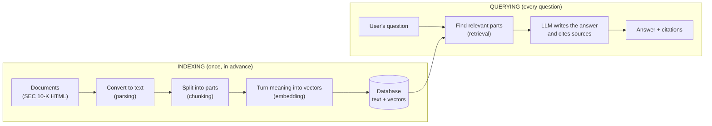

# Chapter 1 — What Is RAG?

> **In this chapter:** why a large language model (LLM) cannot be a reliable "document assistant" on its own, how RAG solves that, and the big picture of Document Copilot.

## 1.1 An analogy: closed-book and open-book exams

Think of a student who has read a lot during the term and remembers it well. In a closed-book exam they answer from memory. They are usually right, but when unsure they do not leave the answer blank; they make up something that sounds right. Asked "how do you know that?", they have no answer.

The same student behaves differently in an **open-book** exam. They find the pages that relate to the question, read them, write the answer based on those pages and note "see page 23" in the margin. If the book does not cover the question, they can say "the book doesn't cover this".

**By default, large language models are closed-book students. RAG turns them into open-book students.**

## 1.2 What is a language model, and what does it know?

Large language models such as GPT or Claude are neural networks trained on huge amounts of text to "predict the next word". What they saw during training is carried, compressed, in their weights (parameters). Therefore:

1. **Their knowledge has a cutoff date.** They do not know a report published after training.
2. **They do not know private documents.** Your company's internal documents or a client's contracts are not in the training data.
3. **They can make things up (hallucinate).** Instead of saying "I don't know", a model may produce a statistically plausible answer. Asked for "Apple's 2024 iPhone revenue", it may give a number close to the real one, but wrong.
4. **They cannot cite sources.** They cannot say which page of which document an answer came from, because the knowledge is spread across the weights, not stored on a page.

For a financial analyst, points 3 and 4 are unacceptable. A wrong figure leads to a wrong investment decision, and an answer without a source cannot be verified, so it cannot be used.

## 1.3 Why "just give the documents to the model" is not enough

The first idea is to send all the documents to the model together with the question. The amount of text a model can see at once is its **context window**.

This project has five years of 10-K reports for five companies. Converted to Markdown they add up to about **18 MB of text**, several million tokens (Chapter 5 explains tokens). That does not fit in the window, and even if it did, paying for millions of tokens on every question would be slow and expensive. Models also tend to miss information in the middle of very long contexts.

So what we need is to **find the few relevant parts of the documents for each question and give only those to the model.** That is exactly what RAG is.

## 1.4 RAG: Retrieval-Augmented Generation

The term became widespread with a 2020 paper by Facebook AI researchers (Lewis et al.). It has three parts:

- **Retrieval:** find the document parts relevant to the question with a search system.
- **Augmented:** add those parts to the model's input (the prompt).
- **Generation:** let the model write the answer based on those parts and show which part it used.

In the open-book analogy: *retrieval* is finding the pages, *augmented* is opening them on the desk, *generation* is writing the answer.

## 1.5 Two phases: indexing and querying

A RAG system works at two different times:

**Indexing** is like organizing a library: shelving the books and preparing catalog cards. It is slow but done once. Indexing our 25 reports took about two hours, most of it spent uploading to the database.

**Querying** is a reader walking in with a question. Because the catalog is ready, the right shelf is found in seconds. Our search returns ten passages for a question in 5–10 seconds.

## 1.6 RAG in Document Copilot

Document Copilot is a chat application where analysts ask questions about SEC 10-K reports. The product's core promise is **trust**:

- Every answer must rest on passages that were actually retrieved.
- Every claim must have a source (company, report, year, page, section).
- When there is no evidence, the system must be able to say "the filings do not contain enough evidence for this".

That is why "looks like it works" is not enough in this project; every step was verified by measurement (Chapter 11).

Where the project stands:

| Step | Status | Chapter |
|---|---|---|
| Downloading documents | ✅ | 2 |
| Converting to text | ✅ | 3 |
| Extracting clean tables | ✅ | 4 |
| Chunking, page, section | ✅ | 5 |
| Embedding | ✅ | 6 |
| Vector search | ✅ | 7 |
| Full-text search | ✅ | 8 |
| Hybrid search (RRF) | ✅ | 9 |
| Answer generation with an LLM, and grounding | ✅ | 12 |
| Question routing and a risk signal with Jev | ✅ | 13 |

Both the "R" (retrieval) and the "G" (generation) of RAG are built.

## 1.7 Why "simple RAG" was not enough for us

Most RAG examples online look like this: "read the PDF, split it into 500-character pieces, embed each, put them in a vector database, give the nearest 5 to the model." That works well for plain text such as blog posts. For financial reports it falls short:

1. **Tables:** most figures live in tables. Cut a table at an arbitrary 500 characters and the number "201,183" loses its "iPhone" and "2024" labels and becomes meaningless (Chapter 4).
2. **Words that must match exactly:** semantic search is poor at terms such as "AWS", "Item 1A" or "10-K"; keyword search is needed (Chapter 8).
3. **Source information:** we need to know which page and section a quote came from. HTML has no pages, so we had to derive that ourselves (Chapter 5).
4. **Filters:** "search only NVIDIA's 2025 report" is not as easy in vector search as it sounds (Chapter 7).

The rest of the book takes these problems one by one.

## Summary

- LLMs do not know private or recent documents, can make things up and cannot cite sources.
- Giving all documents to the model is expensive and often impossible.
- RAG finds the relevant parts for each question and grounds the model's answer in them.
- The system works in two phases: **indexing** in advance and **querying** on every question.
- Financial reports need more than simple RAG because of tables, exact-match terms and source information.

## Sources

- Lewis et al. (2020), *Retrieval-Augmented Generation for Knowledge-Intensive NLP Tasks*: <https://arxiv.org/abs/2005.11401>
- Project architecture: [`docs/architecture.md`](../../architecture.md)
- Client needs and example questions: [`docs/client-brief.md`](../../client-brief.md)

---
Next chapter: [Source data: SEC 10-K reports →](02-source-data.md)
