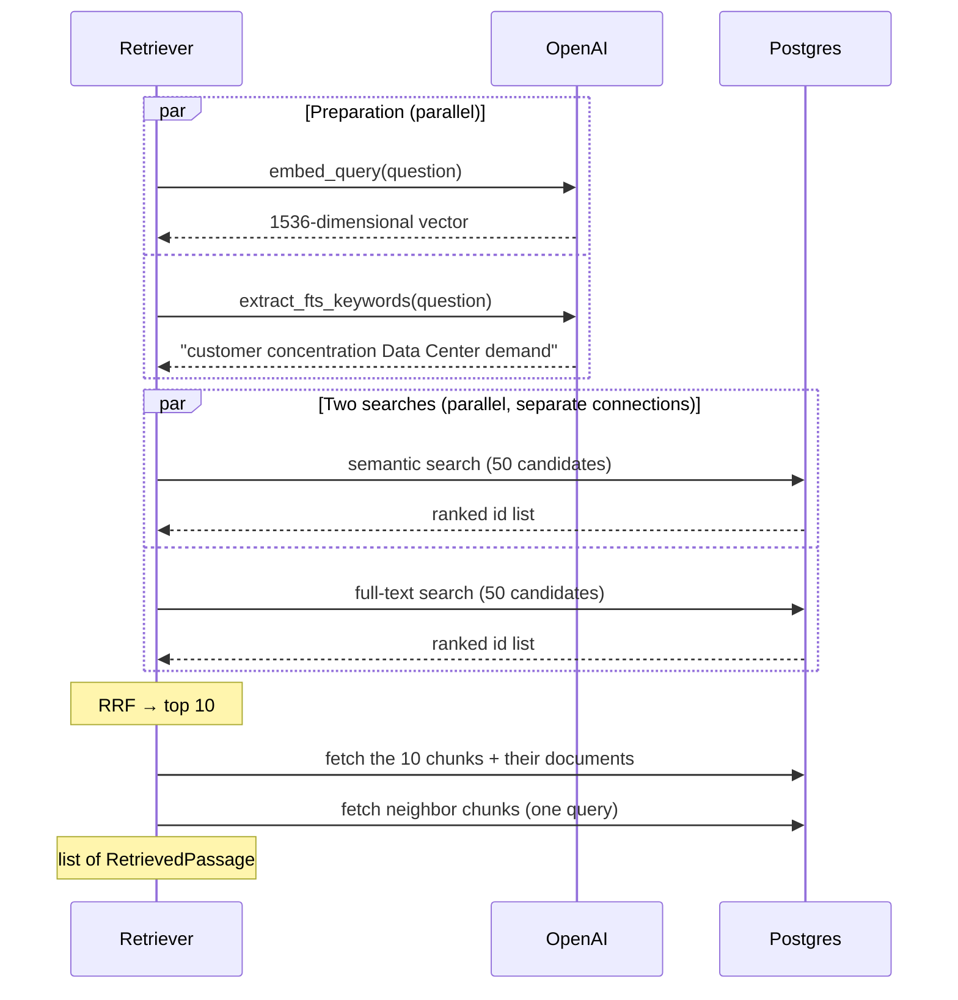

# Chapter 9 — Hybrid Search and RRF

> **In this chapter:** why we use semantic and full-text search together, how two ranked lists are combined with **Reciprocal Rank Fusion (RRF)**, and, step by step, the journey of a question through the whole retrieval layer until it becomes ten passages.

## 9.1 Two searches, two strengths

| | Semantic search (embeddings) | Full-text search (words) |
|---|---|---|
| Strong at | The same meaning in different words ("phone revenue" ↔ "iPhone net sales") | Exact terms, codes, product names ("AWS", "Item 1A", "Blackwell") |
| Weak at | Rare terms, numbers, codes | Synonyms, different phrasing |

In the cookbook's words: keyword search wins when the query and the document **share a rare term**, but collapses when the query is phrased differently; semantic search wins exactly there. Combining them captures both wins. In the cookbook's FiQA measurements (NDCG@10): keyword search ≈ 0.24, semantic search ≈ 0.31, the two combined with RRF ≈ 0.35.

This is called **hybrid search**.

## 9.2 Why the scores cannot simply be added

The two searches produce two different scores:

- Semantic search: cosine similarity, ~0.5–0.8 on our data.
- Full-text search: `ts_rank_cd`, ~0.1 to 2, with no upper bound.

Adding them is like adding meters and kilograms: because the scales differ, whichever search produces bigger numbers decides the result. In the cookbook's example a BM25 score can reach 18.5, so in a simple average keyword search overwhelms semantic search by ~25x.

## 9.3 Reciprocal Rank Fusion (RRF)

RRF's idea is elegant: **throw away the scores, look only at the ranks.** It was proposed in 2009 by Cormack, Clarke and Büttcher. The formula:

```text
RRF(document) = Σ  1 / (k + rank)
               each list
```

- `rank`: the document's position in that list (1, 2, 3, …).
- `k`: a smoothing constant, **60** by default.
- A document missing from a list gets nothing from that list.

### A worked example

Take two lists:

| Document | Semantic rank | Full-text rank | RRF score |
|---|---|---|---|
| A | 1 | missing | 1/61 = 0.0164 |
| B | 2 | 1 | 1/62 + 1/61 = 0.0161 + 0.0164 = **0.0325** |
| C | 3 | 5 | 1/63 + 1/65 = 0.0159 + 0.0154 = **0.0313** |
| D | missing | 2 | 1/62 = 0.0161 |

Final order: **B, C, A, D.** A dropped to third although it was first in semantic search; B and C rose because they appear **in both** searches. That is RRF's core intuition: **a document two independent methods agree on is very likely relevant.**

### Why k = 60?

A small `k` gives the top ranks too much weight (1/1 vs 1/2 is a big gap). A large `k` makes all ranks look alike. 60 is a middle point where top ranks carry meaningful weight but agreement between the two lists still makes a big difference; it is the value that did well experimentally in the paper.

Our code is exactly this short (`backend/app/retrieval/fusion.py`):

```python
def reciprocal_rank_fusion(rankings, *, k=60):
    scores = defaultdict(float)
    for ranking in rankings:
        for rank, chunk_id in enumerate(ranking, start=1):
            scores[chunk_id] += 1.0 / (k + rank)
    return sorted(scores.items(), key=lambda item: item[1], reverse=True)
```

Our real smoke-test scores show it too: scores around ~0.03 belong to passages near the top of both lists (1/61 + 1/62 ≈ 0.0325), and scores around ~0.016 to passages from only one list.

## 9.4 The retriever: a question's journey

What happens when `DocumentRetriever.search(question, filters=...)` is called:



### Step 1: parallel preparation

Embedding the question and extracting keywords are two independent network calls. We start both at once instead of waiting for one (`ThreadPoolExecutor`). The total time is that of the slower one, not the sum.

### Step 2: two parallel searches

Semantic and full-text search also run at the same time. A subtle point: a SQLAlchemy session cannot be used from two threads at once, so each search opens its own session.

Each search returns **50 candidates** (`retrieval_candidate_k`). Why 50 and not 10? Because fusion looks for the overlap of the two lists. A wide candidate pool also catches a passage that is 30th in one search and 2nd in the other.

### Step 3: fusion

RRF combines the two lists and the top **10** (`retrieval_top_k`) are kept.

### Step 4: hydrating the passages

The searches returned only ids. Now the 10 chunks' text, page, section and document information are fetched in one query.

### Step 5: neighbors

Each hit's previous and next chunk (`retrieval_neighbor_radius = 1`) is added as context. Seeing what comes before a passage that starts with "This increase…" matters for a correct answer. A neighbor already among the hits, or already added as another hit's neighbor, is not added again.

> **A performance note.** The reference fetches each hit's neighbors with a separate query: 10 hits, 10 queries. Every round trip to our database takes ~360 ms, so that meant ~3.6 seconds per search. We fetch all neighbors in one query (`get_neighbor_chunks`).

### Step 6: filters

`SearchFilters(ticker="NVDA", fiscal_years=[2025], form="10-K")` is added to both searches as the same SQL condition. Values are bound as parameters, not embedded in the SQL text, the standard protection against SQL injection. Chapter 7 showed why filters need a special measure (iterative scan) in semantic search.

### Step 7: text for the agent

`format_passages_for_agent` turns the passages into a bounded text for the language model:

```text
NVDA 10-K FY2025 p.79 (Item 15. Exhibits and Financial Statement Schedules) [3f2a…]: Revenue by geographic area ...
  neighbor idx=611 [9b1c…]: ...
```

Each passage starts with the company, form, year, page, section and **chunk id**; the language model cites with these ids (Chapter 12). There is a limit of 800 characters per passage and 12,000 in total, so the model is not flooded with needless input.

## 9.5 Settings

All in `backend/app/config.py`, and overridable with environment variables:

| Setting | Value | Role |
|---|---|---|
| `retrieval_candidate_k` | 50 | Candidates each search returns before fusion |
| `retrieval_top_k` | 10 | Passages returned after fusion |
| `retrieval_rrf_k` | 60 | The RRF constant |
| `retrieval_neighbor_radius` | 1 | Chunks added before/after each hit |
| `retrieval_fts_keyword_model` | `gpt-4.1-mini` | Keyword model |
| `retrieval_fts_keyword_max` | 5 | Keyword budget |

## 9.6 The next level: reranking

The cookbook adds one more step after hybrid search: **reranking with a cross-encoder**. An embedding turns the question and the passage into separate vectors; a reranker reads the question and the passage **together** and scores "does this passage answer this question?". It is slower and paid (the cookbook uses Cohere's reranker), but raises NDCG@10 on FiQA from ≈ 0.35 to above ≈ 0.40. Our reference project has no such step; it is a strong option for improving quality later.

## Summary

- Semantic and full-text search cover each other's weak spots; hybrid search combines them.
- Scores on different scales cannot be added; RRF uses only ranks: `Σ 1/(60 + rank)`.
- Passages found by both searches rise to the top; that "agreement" is a strong sign of relevance.
- The retriever: parallel preparation → two parallel searches (50 candidates each) → RRF (top 10) → passages → neighbors → bounded agent text.
- With remote databases, cutting round trips saves serious time.

## Sources

- The RRF paper, Cormack, Clarke and Büttcher (SIGIR 2009): <https://plg.uwaterloo.ca/~gvcormac/cormacksigir09-rrf.pdf>
- Cookbook, hybrid search tutorial with RRF and reranking explained: <https://github.com/daveebbelaar/ai-cookbook/tree/main/knowledge/hybrid-retrieval>
- Code: `backend/app/retrieval/retriever.py`, `fusion.py`, `types.py`, `backend/app/database/documents.py`

---
[← Full-text search](08-full-text-search.md) · Next chapter: [Ingestion pipeline and database →](10-ingestion-and-database.md)
