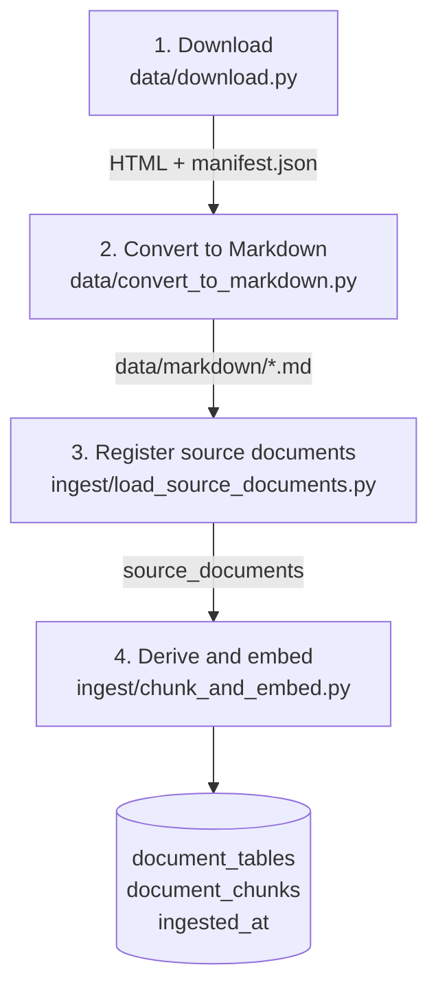
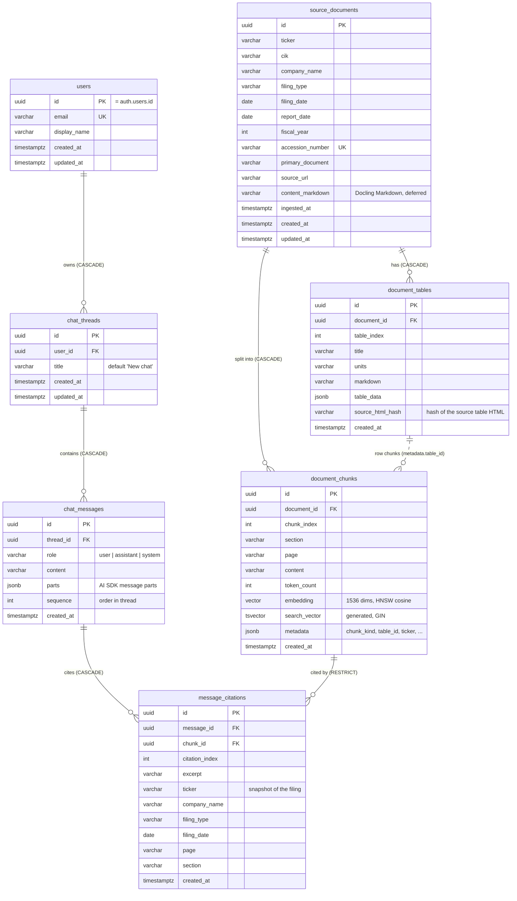

# Chapter 10 — Ingestion Pipeline and Database

> **In this chapter:** how the steps from earlier chapters form an end-to-end pipeline, how the data sits in the database, the design decisions that make the pipeline reliable (one transaction, re-runnability), and the performance lessons from working with a remote database.

## 10.1 The whole pipeline



Commands (from `backend/`):

```bash
uv run python ../data/convert_to_markdown.py                  # 25 files, ~1.5 minutes
uv run python -m ingest.load_source_documents                  # source stage
uv run python -m ingest.chunk_and_embed --all --dry-run        # chunk only: no cost, no writes
uv run python -m ingest.chunk_and_embed --all                  # embed and write (paid, ~2 hours)
```

## 10.2 The source stage and the derivation stage

The split introduced in Chapter 2 becomes concrete here.

**The source stage** (`load_source_documents.py`) writes one `source_documents` row per filing in the manifest: company, dates, accession and Markdown text. It is free. The same document is never registered twice (`accession_number` is unique).

**The derivation stage** (`chunk_and_embed.py`) does these steps for each document **in one database transaction**:

1. If the document has chunks and `--force` is not given, skip it.
2. Produce the chunks (Chapters 4 and 5) and get their embeddings (Chapter 6).
3. Delete the document's old derived data. The order matters:
   - first the **citations** of those chunks (`message_citations`),
   - then the **chunks**,
   - then the **tables**.
4. Insert the tables and **`flush`**. This makes the database assign ids to the tables without ending the transaction.
5. Write each table's id (`table_id`) into the metadata of its row chunks and insert the chunks.
6. Write the `ingested_at` time.
7. **`commit`**: everything becomes permanent at once.

### Why one transaction?

A transaction means "all or nothing". If the power fails, the network drops or an error occurs halfway, the database returns to its state before the transaction. As a result:

- **No half documents:** a document with its tables written but not its chunks cannot exist.
- **No broken links:** a chunk's `table_id` always points to a table written in the same run.

We saw this in practice: after fixing code we stopped a running ingestion halfway. The interrupted document's transaction had not been committed, so it was rolled back and no partial data was left in the database.

### Why are citations deleted first?

`message_citations.chunk_id` is a **foreign key** defined with `ON DELETE RESTRICT`: a chunk cannot be deleted while a citation points to it. This is a deliberate safeguard that keeps a cited chunk from disappearing by accident. When re-ingestion is done on purpose, the citations must be cleared first.

## 10.3 Re-runnability (idempotency)

An operation is **idempotent** if running it twice with the same input does not change the result. Our pipeline is:

- A second `--all` run skipped all 25 documents: `0 processed, 25 skipped`.
- Each document is committed separately, so a run interrupted at document 12 skips the first 11 when restarted and continues where it stopped.
- `--force` exists to regenerate on purpose; we use it when code changes.
- `--dry-run` shows how many chunks will come out, the token limit and the distribution, without paid calls or database writes: a cheap rehearsal before an expensive operation.

## 10.4 The database schema

The database has two groups of tables: the RAG side (`source_documents`, `document_tables`, `document_chunks`) and the chat side (`users`, `chat_threads`, `chat_messages`, `message_citations`). The only bridge between them is `message_citations`: it records which chunk an answer cited.



Constraints and indexes beyond the diagram: unique `(document_id, chunk_index)` on `document_chunks`, `(document_id, table_index)` on `document_tables`, `(thread_id, sequence)` on `chat_messages` and `(message_id, citation_index)` on `message_citations`; an HNSW cosine index on `document_chunks.embedding` and a GIN index on `search_vector`; `(ticker, fiscal_year)` on `source_documents`. `alembic_version` holds the current migration revision. Deleting a filing removes its chunks and tables; a chunk that a stored answer cites cannot be deleted (`RESTRICT`), so re-ingesting a cited filing first removes the citations (see `ingest/chunk_and_embed.py`). The dotted line is a JSON reference, not a foreign key.

| Table | Holds | Important columns / indexes |
|---|---|---|
| `source_documents` | Each 10-K | `accession_number` (unique), `fiscal_year`, `content_markdown` (deferred), `ingested_at` |
| `document_tables` | Clean tables | `(document_id, table_index)` unique, `table_data` JSON |
| `document_chunks` | Searchable pieces | `content`, `page`, `section`, `embedding vector(1536)` + **HNSW** index, `search_vector tsvector` (generated) + **GIN** index, `metadata` JSON |
| `users` | Signed-in users | `id` = Supabase `auth.users.id`, `email` (unique) |
| `chat_threads` | Conversations | `user_id`, `title` (from the first question), `updated_at` (sidebar order) |
| `chat_messages` | Ordered messages | `(thread_id, sequence)` unique, `role`, `parts` (AI SDK parts, citations included) |
| `message_citations` | Citations in answers | `chunk_id` (RESTRICT), `(message_id, citation_index)` unique, a copy of the quoted text and filing information |

`message_citations` stores a **copy** of the quoted text and the filing information. Even if documents are re-chunked later, what an old answer rested on stays verifiable.

The schema is managed with **Alembic migrations**: SQLAlchemy models define the tables, migrations apply them to the database. Parts that cannot be autogenerated, such as `create extension vector` and RLS, are added by hand.

**Row Level Security (RLS):** document tables can be read by any signed-in user but written by none. Only the ingestion pipeline writes them, through a direct database connection that bypasses RLS. Chat tables are open only to their owner: a user can see and write only their own threads, messages and citations.

## 10.5 Lessons from working with a remote database

Our Supabase database is in a remote region. We measured the effects:

| Measurement | Value |
|---|---|
| Opening a connection | ~5.6 s |
| One query round trip | ~360 ms |
| Fetching a 0.5 MB row | ~7 s |
| Upload speed | ~40 KB/s |

The lessons:

1. **Reuse connections.** Opening a new connection per query loses seconds. We keep one engine and connection pool per process (`backend/app/database/session.py`).
2. **Cut round trips.** That is why neighbor chunks come in one query (Chapter 9) and two `SET` commands go in one `SELECT` (Chapter 7).
3. **Do not carry unneeded data.** The "does the document exist?" check downloaded whole rows (including 1 MB of Markdown) and took 43 seconds; fetching only ids brought it to 7 seconds. Large columns are `deferred` in the model.
4. **Bandwidth is a hidden cost.** Embeddings take ~19 KB as text; 16,500 chunks add up to ~300 MB and the upload took over 2 hours. The deciding factor was the upload, not the OpenAI call that took seconds.
5. **A running process uses old code.** When we fixed code, the background ingestion was still running the old version. We stopped it so it would not keep producing bad data, and restarted with `--force`.

## 10.6 Fixing in place: without reloading everything

After ingestion finished we found two more problems (link noise and wrong table titles). Instead of reloading the whole corpus for two hours, we updated **only the affected rows**:

- Link cleanup: 774 chunks found, 765 updated and re-embedded, 9 consisting only of a link deleted.
- Table titles: 241 tables and 3,119 table-row chunks updated.

Both fixes ran in one transaction, and the same rules were added to the chunking code, so a future re-ingestion gives the same result. The fix scripts had safety checks: the script would stop if a table's content had changed or row counts did not match.

## Summary

- The pipeline has four steps: download → convert to Markdown → register source documents → derive and embed.
- Derived data is written per document in one transaction, with care for the delete order; no half or broken data is left.
- The pipeline is idempotent: re-running skips finished work; `--dry-run` gives a free rehearsal.
- With a remote database the cost is the number of round trips and the amount of data carried; we measured and cut both.

## Sources

- PostgreSQL transactions: <https://www.postgresql.org/docs/current/tutorial-transactions.html>
- Code: `backend/ingest/load_source_documents.py`, `backend/ingest/chunk_and_embed.py`, `backend/app/database/models/`, `backend/alembic/versions/`

---
[← Hybrid search and RRF](09-hybrid-search-and-rrf.md) · Next chapter: [Measuring quality →](11-measuring-quality.md)
