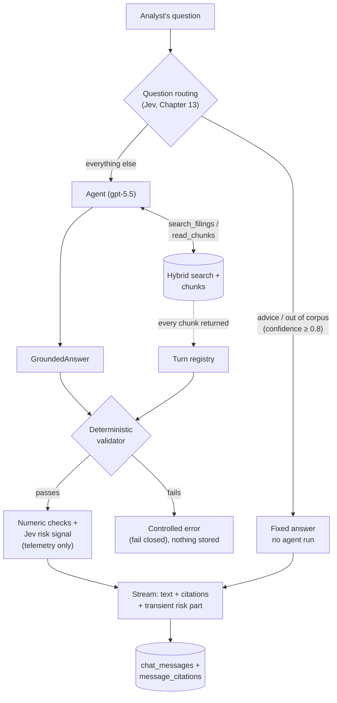

# Chapter 12 — Answer Generation and Grounding

> **In this chapter:** the "G" of RAG, generation, as we actually built it: an **agent** that gives the language model search tools, **structured output** that fixes the answer's shape, **grounding layers** that check in code that the answer rests on its sources, and what we learned while measuring all of it. The two layers that use Jev (question routing and the risk signal) are the next chapter's topic.

## 12.1 Search results are not an answer

Chapter 9's hybrid search returns 10 relevant passages for a question. But an analyst wants an answer, not 10 passages: *"How did Services' share of Apple's revenue mix change from 2021 to 2025?"* That means reading the passages, comparing figures across years, writing the result clearly and **showing which passage each claim came from**. The language model does this; this chapter covers the structure we built around it so it does so reliably.

## 12.2 The agent: giving the model search tools

Classic RAG is a one-way flow: question → one search → passages into the prompt → answer. That is not enough for our questions. As the smoke test showed, for Apple's revenue table question the first results were the table's footnotes; the actual rows were in neighboring chunks.

So we use **agentic RAG**: the language model (`gpt-5.5` for us) gets search **tools** and decides itself when and with what to search. The agent is built with **PydanticAI** (`backend/app/assistant/agent.py`):

| Tool | What it does | Returns |
|---|---|---|
| `search_filings(query, ticker, form, fiscal_years)` | Calls Chapter 9's hybrid search | 10 passages + neighbors, each as an **800-character excerpt** |
| `read_chunks(chunk_ids)` | Reads several chunks at once | The chunks' **full text** |
| `read_chunk(chunk_id)` | Reads one chunk | Full text |
| `read_surrounding_chunks(chunk_id, radius)` | Reads a chunk's surroundings | Full text, in order |

**Excerpt or full text?** In the reference project the read tools also cut text at 800 characters. We measured: **70.7%** of narrative chunks are longer than 800 characters. A model cannot quote text it never saw, so the read tools return full text, while search results stay excerpts. That is the common "search returns snippets, fetch returns the document" pattern. Total output is still capped at 12,000 characters; a chunk that does not fit is not cut in half but listed by id for a separate read.

**The turn registry: the citation allowlist.** Every chunk a tool returns during the turn (neighbors included) is written to a registry (`TurnRegistry`). The answer may cite **only** those chunks; the model cannot make up a chunk from memory or from another message (`backend/app/assistant/deps.py`).

## 12.3 Structured output: `GroundedAnswer`

The model does not return free text; PydanticAI makes it return a typed object:

```python
class Citation(BaseModel):
    citation_index: int     # the [n] in the text
    chunk_id: UUID          # the cited chunk
    excerpt: str            # text copied verbatim from that chunk

class GroundedAnswer(BaseModel):
    answer: str                        # answer text with "[1]", "[2]" markers
    citations: list[Citation]
    insufficient_evidence: bool = False
```

Because the output's shape is guaranteed, we never try to parse the answer as text; which chunk each citation points to is exact (`backend/app/assistant/outputs.py`).

## 12.4 The product contract: instructions

The model's rules live in a separate file (`backend/app/assistant/instructions.md`): rely only on passages returned by the tools, put `[n]` on every claim, say "not enough evidence" and cite nothing when there is none, give no investment advice, do not assert causation the filings do not state.

The file grew as we measured. Each rule below came from a real bug:

| Rule | From which measurement |
|---|---|
| The corpus is only the 10-Ks of 5 companies; there are no 10-Qs | So the model does not filter for a nonexistent 10-Q and get nothing |
| An excerpt never contains the tool output's header line (`AAPL 10-K FY2024 p.23 … [id]:`) | gpt-5-mini did this in 5 of 10 answers |
| Keep excerpts short, drop no words from inside; two separate spots need two citations | gpt-5.5 dropped sentences from inside 773–2,202-character excerpts |
| With no year in the question, use the latest year and say so | gpt-5-mini answered "Apple's revenue?" with FY2024 instead of FY2025, without saying which year |
| For broad questions, answer from the evidence found | Two multi-company questions hit the 200K-token limit |

## 12.5 A message's journey



This flow is owned by `backend/app/chat/orchestrator.py` in code. A few details:

- While the agent works, **status messages** such as "Searching SEC filings…" stream as transient parts; they do not enter the message history. The user sees what the system is doing from the first second.
- Streaming does not start before the answer is complete: it is validated first, then streamed word by word. We do not want to show half of an unvalidated answer.
- If the user closes the page while the agent runs, the agent is cancelled and stops spending money.
- Citations go out as `data-citation` parts and are written to `message_citations` **from those parts**, so what is shown and what is stored never diverge.

## 12.6 Grounding layer 1: the deterministic validator

Telling the model "rely only on the passages" is a **request**. Code turns grounding into a **rule**: `backend/app/grounding/validator.py`. It calls no LLM, gives the same result every time and takes milliseconds.

| Check | Error code |
|---|---|
| Is the answer empty? | `empty_answer` |
| Is an answer without citations marked "insufficient evidence"? | `missing_citations` |
| Does an "insufficient evidence" answer carry citations? | `insufficient_evidence_with_citations` |
| Does every `[n]` in the text match a citation, and every citation an `[n]`? | `marker_without_citation`, `citation_not_referenced` |
| Do the numbers start at 1 without gaps? | `duplicate_citation_index`, `citation_indices_not_contiguous` |
| Was the cited chunk retrieved during this turn (turn registry)? | `chunk_not_retrieved` |
| Is the excerpt **verbatim** in that chunk? | `excerpt_not_in_chunk` |
| Is the excerpt long enough to mean something (at least 12 characters)? | `excerpt_too_short` |
| Is there a money amount or percentage on a line without any marker? | `uncited_figure` |

**Verbatim, but smart.** Before the "verbatim" comparison, differences that do not change meaning are evened out: whitespace, Unicode forms, curly quotes, hyphen variants and Markdown table markup (`|`, `|---|`). Words and numbers must still match, in order. Two of these rules were found while testing with a different model: `gpt-oss` wrote every hyphen as U+2011 (non-breaking hyphen) and word-for-word correct excerpts were rejected. With a model that never makes that mistake we would never have seen the gap.

**Fail closed.** If a rule breaks, the answer is neither shown nor stored; the user sees "I could not verify the answer against the sources". An ugly error beats a polished but unsupported answer.

## 12.7 Grounding layer 2: numeric checks

In financial answers the most dangerous error is a wrong figure. The validator proves an excerpt is in its source, but not that the figure in the answer text matches the excerpt. `backend/app/grounding/numeric.py` does that: it checks every financial figure in the answer against the numbers in the cited sources, in code.

| Result | Meaning | Example |
|---|---|---|
| `exact` | The same number is in the source | Answer "$24,967", source "24,967" |
| `scaled` | It is there in other units | Answer "$25.0B", a millions table says "24,967" |
| `derived` | It can be computed from two source numbers | Margin "6.4%" = 24,967 / 387,497; growth; the rest of a share (48% → 52%) |
| `unverified` | None of the above | A changed figure |

Integer percentages (such as "6%") are not counted as "derived": with dozens of numbers in a source, the ratio of two random numbers easily hits an integer. This layer **does not block** the answer, it only warns, because a correct answer may write a figure in a form our rules do not recognize.

Measured effect: it caught 15 of 17 fake claims with a changed figure on its own, without Jev. A claim takes about 0.2 ms.

## 12.8 Safety limits and the anatomy of cost

Every message's agent run is guarded by these limits (`backend/app/config.py`): at most 20 model requests, 15 tool calls, 100K total tokens, 20K output tokens and 12K output tokens per response. A run that hits a limit stops without an answer; cost cannot get out of hand.

**Why does one question take 40–170K tokens?** The question is one sentence, but the agent makes 5–10 requests to the model to reach an answer, and **every request re-sends the whole conversation so far**: the instructions and tool schemas (~1,400 tokens), every search result (~3,000 tokens), every read. In Q1 the largest single request was 10,669 tokens, yet the six requests added up to 36,524 tokens.

**Caching makes this cheaper.** OpenAI reads the repeated beginning from its cache and bills it at a tenth of the price; in our measurements 55–79% of the input was read that way.

**Most of the cost is output.** With `gpt-5.5`, output tokens cost six times as much as input ($30 vs $5 per million tokens). Of Q1's $0.216, $0.130 came from 4,327 output tokens, ~40% of them reasoning tokens: thinking the model does internally that we never see.

## 12.9 What we learned by measuring

**The 10 client-brief questions (gpt-5.5):** 6 passed validation. Two were rejected; in all three rejected excerpts the model had dropped a sentence or phrase from inside a long excerpt, so the rejection was right. Two hit the 200K-token limit. Every figure checked by hand was correct: the 25 revenue shares in Q1 and the 15 segment margins in Q2 matched the database tables exactly. $0.22–0.43 and 60–100 seconds per question.

**Free models:** `gpt-oss:120b` and `nemotron-3-super` on Ollama called one tool per turn, repeated the same searches and produced no answer even at 250K tokens. A small test showed this was the models' behavior, not the API's: on the same API Nemotron could call tools in parallel. Gemini's free models returned overload errors (503); Groq's free tier, at 8K tokens per minute, could not carry even a single request.

**Cheap models (for "simple" questions):** `gpt-4.1-mini` got 11 of 15 questions through validation, `gpt-5-mini` 8. But two risky behaviors showed up: answering a question without a year with an older year's figure without saying so, and reaching the right conclusion through an irrelevant citation. So no cheap model is used; the bugs found became instruction rules (12.4).

**Lesson:** "cheap model = cheap answer" does not hold. A model that uses tools inefficiently multiplies the token count, even at a low token price.

## 12.10 Blind spots

What do our layers miss? The measurements showed two kinds:

1. **A verbatim but irrelevant citation.** A model concluded "Amazon pays no dividend" by quoting a passage about executives' stock trading plans. The excerpt is verbatim in its source (the validator passes) and has no figure (the numeric layer says nothing).
2. **The wrong year.** Answering an FY2024 question with a correct excerpt from the FY2023 row. The excerpt is verbatim, the figure is in the source, the source really supports the claim; no layer checks **whether the answer matches the question**.

That is why the citation panel in the UI matters: the analyst can see the text behind every claim with one click. The last layer of trust is still a person.

## Summary

- The agent uses its search tools itself; search returns excerpts, reads return full text, and only chunks retrieved in this turn can be cited.
- The answer is a typed object: text, `[n]` citations and an "insufficient evidence" flag.
- The deterministic validator checks citation integrity in code and does not show a broken answer (fail closed); the numeric layer checks figures, including unit conversions and computations, and warns.
- Most rules in the instructions file came from real bugs seen while measuring.
- Most of the cost is output and reasoning tokens; input grows because every request re-sends the conversation, and caching makes that cheaper.
- Blind spots: a verbatim but irrelevant citation, and the wrong year.

## Sources

- PydanticAI: <https://ai.pydantic.dev/>
- Cookbook, agentic RAG example: <https://github.com/daveebbelaar/ai-cookbook/tree/main/knowledge/agentic-rag>
- OpenAI pricing and prompt caching: <https://developers.openai.com/api/docs/pricing>
- Code: `backend/app/assistant/`, `backend/app/grounding/`, `backend/app/chat/orchestrator.py`, `backend/scripts/smoke_assistant.py`

---
[← Measuring quality](11-measuring-quality.md) · Next chapter: [Jev: typed decisions →](13-jev-typed-decisions.md)
