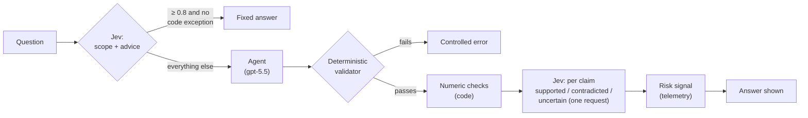

# Chapter 13 — Jev: Typed Decisions, a Risk Signal and Question Routing

> **In this chapter:** we meet TypeSafe AI's Jev model: a model that produces no text, only **typed decisions**. We use it in two places in our RAG system: as a **risk signal** after the answer is validated, and as a **router** before a question reaches the agent. We look at both designs, their measurements, and the work Jev is actually good at.

## 13.1 The starting question: an LLM judge

Chapter 12's deterministic validator proves an excerpt is **verbatim** in its source, but not that the source **supports the claim in meaning**. The source can say "revenue increased" while the answer writes "revenue decreased [1]" and quotes the same sentence.

The common idea for closing this gap is an **LLM judge**: after the answer is written, ask a second model "does this source support this claim?". The reference project does this with `gpt-4.1-mini` and blocks the answer when the judge says "no".

Our approach differs: Jev is not a judge that **blocks** answers but only a **risk signal**. Whether an answer is shown is still decided by the deterministic validator alone.

## 13.2 What is Jev?

Jev is the first model in a class TypeSafe AI calls "System One". It is not a chat model: it takes a **state** (`state`) and **typed questions**, and answers each question within its type. It produces no free text.

| Question type | Returns | Where we use it |
|---|---|---|
| `choice` | One of the options you define, each option's probability and a confidence | Claim–source relation, the question's scope |
| `noul` | The probability of "yes" for a yes/no question (0–1) | Does it ask for investment advice? |
| `score` | A score on an ordered scale | Not used |

A request and its answer, roughly:

```json
// request
{"model": "jev-latest",
 "state": {"claim": "NVIDIA's gross margin decreased to 75.0%", "sources": {"S1": "Gross margins increased to 75.0% ..."}},
 "questions": {"c1": {"type": "choice", "instructions": "How do the sources relate to the claim?",
                      "criteria": {"supported": "...", "contradicted": "...", "uncertain": "..."}}}}
// answer
{"answers": {"c1": {"choice": "contradicted", "confidence": 1.0,
                    "probabilities": {"supported": 0.0, "contradicted": 1.0, "uncertain": 0.0}}},
 "usage": {"input_tokens": 480}}
```

Practical properties: $0.042 per million input tokens, output free (about $0.00002 per claim in our measurements); 0.3–1 second per request; a 32K-token context window. **Several questions on the same `state`** are answered in one request, in parallel and independently of each other.

Read the "cannot hallucinate" claim carefully: Jev cannot say anything outside the defined options, but it can pick the **wrong option**. For a judge, what matters is whether the decision is right.

## 13.3 The risk signal: after the answer is validated

The design principle: **do not use Jev where it is weak; do that part in code and use Jev only for the rest.** Early tests showed two weaknesses: asked about a sentence with only one of the sources that sentence cites, Jev says "this source does not mention most of this"; and it cannot connect unit-converted or computed figures to their source ("$25.0B / 6.4%" in the answer, 24,967 and 387,497 in a millions table). The design makes three decisions accordingly:

1. **A claim = a sentence or table row**, with **all** of its sources. Table rows get their column headers as context, so Jev knows which number belongs to which segment (`backend/app/grounding/claims.py`).
2. **Figures in code.** Chapter 12.7's numeric checks recognize unit conversions and computed percentages. When Jev says "uncertain" but code verified every figure of the claim, Jev's doubt is ignored. A "contradicted" decision is never suppressed this way.
3. **One request, many questions.** All claims of an answer go in one request; each source text appears once in the `state` and every claim is its own question (`judge_claims`, `backend/app/grounding/judge.py`).

Jev's decision becomes a **risk level** (`backend/app/grounding/risk.py`):

| Jev's decision | Confidence | Risk |
|---|---|---|
| any | < 0.5 | ignored |
| `contradicted` | 0.5–0.8 | warning |
| `contradicted` | ≥ 0.8 | **high risk** |
| `uncertain` | ≥ 0.5 | warning (ignored if code verified every figure) |
| — | — | a figure code could not verify: warning |

**No row blocks the answer.** The result goes to the log (`grounding_risk`), to `TurnOutcome.risk` and to the UI as a transient data part. If Jev is unreachable or does not answer within 10 seconds, only a note is recorded; without a key Jev is never called.

**How we measured.** With no labelled data we used **synthetic negatives**: 21 real claims from 4 validated gpt-5.5 answers (right answer: no signal) and copies broken in code: a changed number, a flipped direction ("increased" → "decreased"), or the claim paired with another company's source (right answer: flagged).

**Result (68 cases):**

| | One batched request (used) | One request per claim |
|---|---|---|
| False alarms on real claims | **0/21** | — |
| Broken copies flagged | 40/47 | 41/47 |
| Jev supporting the real claims | **21/21** | 18/21 |
| Requests | **16** | 68 |
| Input tokens | **58,398** | 79,864 |
| Latency per request (median) | **0.69 s** | 0.83 s |

Broken copies by kind: unrelated source 21/21, changed number 16/17 (the numeric layer caught 15 on its own), flipped direction 3/9. Cost per message ~$0.00015 and ~0.7 seconds.

**An honest assessment.** In this design, the numeric checks do most of the work. Jev's contribution that code cannot make is catching contradictions of direction and meaning, and there its catch rate is low (3/9): in long, multi-fact claims the flipped word sits in a secondary part of the sentence and Jev decides with low confidence. Jev also did not flag the two blind spots we saw in real use (Chapter 12.10: a verbatim but irrelevant citation, the wrong year). So the risk signal stays on as telemetry; real usage data will decide whether it stays.

## 13.4 Where Jev is strong: question routing

An article on Jev in fintech (in the sources) matched our finding: Jev is strong at short decisions with few options such as **triage and routing**, and weak at work that needs **evidence synthesis**. Claim–source verification is closer to the second kind. So we also put Jev **before** the agent (`backend/app/assistant/router.py`).

Before a question reaches gpt-5.5, Jev gets two questions in one request:

- `scope` (`choice`): is it in the corpus (`in_corpus`), about another company, about years outside the corpus, or about something annual reports cannot contain (stock prices, forecasts, news)?
- `advice` (`noul`): does it ask for investment advice, a stock pick or a price target?

**The decision is in code, not in Jev.** This is the article's "policy engine" in practice:

1. Advice probability ≥ 0.8 → a fixed refusal; the agent does not run.
2. Out of scope with confidence ≥ 0.8 → a fixed "I can't answer this from these filings"; the agent does not run.
3. **A deterministic exception:** even if Jev says "another company", a question naming a corpus company or its ticker is not turned away. The Apple part of "compare Apple and Samsung" can be answered.
4. Everything else, including a Jev failure or a 2-second timeout, goes to the agent: the previous behavior.

**Why 0.8?** The costs of the two mistakes are asymmetric. A wrong short-circuit refuses a legitimate question; a wrong agent call only costs ~$0.3 more. Every question we cannot be sure about goes to the agent.

**Result (48-question benchmark, two runs):**

| Metric | Result |
|---|---|
| An in-corpus question wrongly turned away (critical) | **0/25** |
| Exact match with the expected decision | 46/48 |
| Out-of-scope and advice questions correctly short-circuited | 18/20 (the 2 missed went to the agent) |
| Same decision across the two runs | 48/48 primary decisions |
| Cost / latency per question | ~$0.00003 / 0.3–0.9 s |

In the app, "Should I buy NVIDIA stock?" and "What was Tesla's revenue in 2024?" are answered in 0.4 seconds; had the agent run, each would have cost ~$0.3 and ~60 seconds.

There is also something we chose not to do: we measured also asking Jev whether a question is "simple or complex" and sending simple ones to a cheap model. Jev's split was reliable on single-figure questions, but the cheap models showed error messages and a wrong-year risk even there (Chapter 12.9). The feature was removed; the tokens sent to Jev dropped by 12%.

## 13.5 Architecture summary: where is Jev?



Two rules keep the design consistent: **Jev classifies, code decides**; and **if Jev is unreachable, the system works as it would without Jev.**

## 13.6 Advantages and limits

| Advantage | Limit |
|---|---|
| Very cheap: ~$0.0002 per message (routing + risk) | An early-access, closed-source service; prices and API may change |
| Fast: 0.3–1 s | Question and answer text go to a third party; SEC data is public, analysts' questions are not |
| Typed output: no parsing, with probabilities and confidence | Confidence values need calibrating; do not pick a threshold without measuring on your own data |
| Many questions in one request; sources sent once | Weak on unit-converted and computed figures |
| Consistent on short classifications (48/48 primary decisions identical across two runs) | Low confidence on long, multi-fact claims; contradictions in the details can slip through |

**When not to use Jev?** The article's list matched our experience: exact math and rules (write deterministic code), long reasoning and evidence synthesis, irreversible high-impact decisions (use it only as a supporting signal), data that cannot be sent to a third party, and new situations not validated on your own data.

## Summary

- Jev produces no text; it returns `choice`, `score` and `noul` decisions with probabilities and confidence. It is cheap and fast.
- In the risk signal, figures are verified in code, claims (sentences or rows with all their sources) are asked in one request, and the result never blocks an answer: 0/21 false alarms on real claims.
- Jev fits question routing best: it answers advice and out-of-scope questions without an agent run while turning away no in-corpus question.
- The principle: the model classifies, the policy is in code; when unsure, keep the existing path; if Jev is unreachable, the system works without it.

## Sources

- TypeSafe documentation: <https://docs.typesafe.ai/introduction> · API: <https://docs.typesafe.ai/api.md>
- Jev's announcement: <https://typesafe.ai/blog/introducing-system-one-models-and-jev>
- Jev in fintech: use cases, risks and when not to use it (Turkish): <https://www.tuncer-byte.com/tr/blog/jev-fintech-kullanim-alanlari-riskler-open-source-alternatif>
- Code: `backend/app/grounding/{claims,numeric,judge,risk}.py`, `backend/app/assistant/router.py`, `backend/scripts/eval_judge.py` (risk-signal benchmark), `backend/scripts/eval_router.py`

---
[← Answer generation and grounding](12-answer-generation-and-grounding.md) · [Glossary →](glossary.md)
