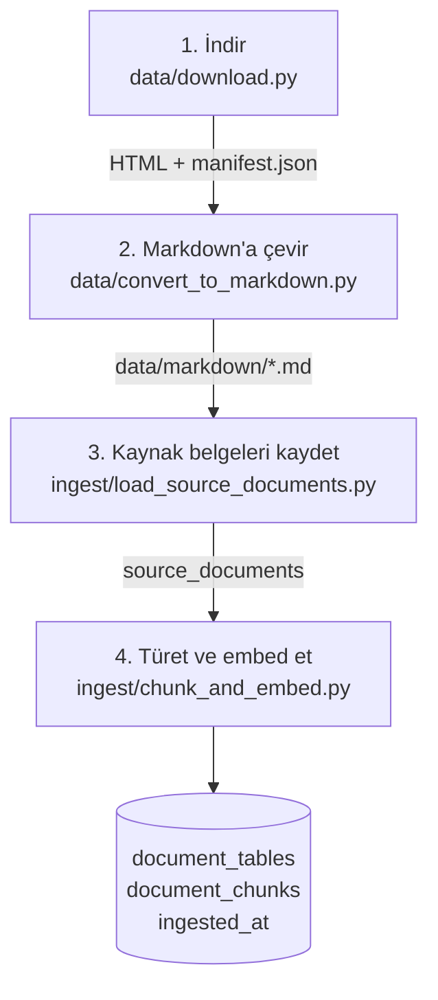
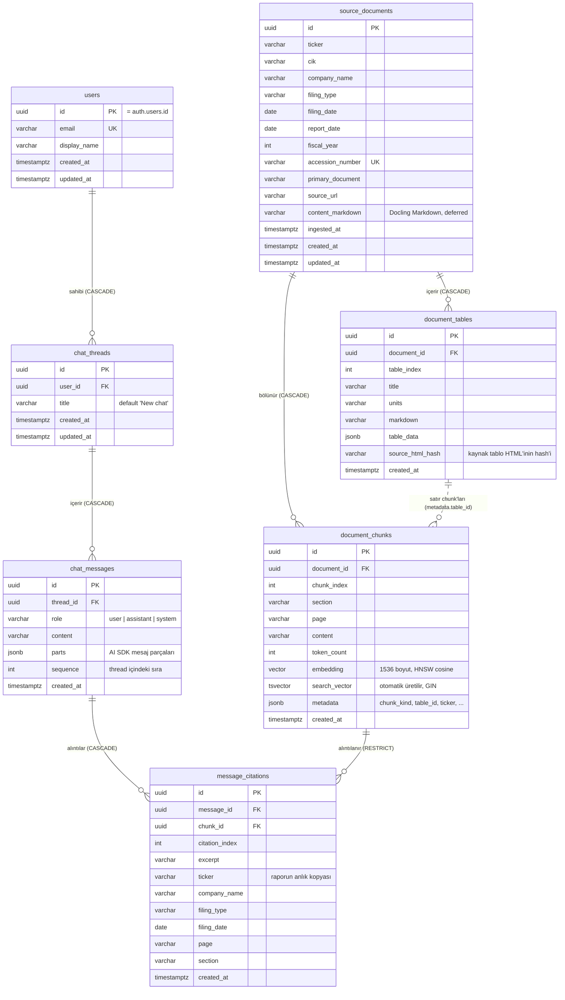

# Bölüm 10 — Yükleme Hattı ve Veritabanı

> **Bu bölümde:** Önceki bölümlerde tek tek gördüğümüz adımların uçtan uca nasıl bir "hat" (pipeline) oluşturduğunu, verinin veritabanında nasıl durduğunu, hattı güvenilir yapan tasarım kararlarını (tek transaction, tekrar çalıştırılabilirlik) ve uzak bir veritabanıyla çalışırken öğrendiğimiz performans derslerini göreceğiz.

## 10.1 Hattın tamamı



Komutlar (`backend/` klasöründen):

```bash
uv run python ../data/convert_to_markdown.py                  # 25 dosya, ~1,5 dakika
uv run python -m ingest.load_source_documents                  # kaynak aşaması
uv run python -m ingest.chunk_and_embed --all --dry-run        # sadece chunk'la, ücret yok, yazma yok
uv run python -m ingest.chunk_and_embed --all                  # embed et ve yaz (ücretli, ~2 saat)
```

## 10.2 Kaynak aşaması ve türetme aşaması

Bölüm 2'de tanıttığımız ayrım burada somutlaşıyor.

**Kaynak aşaması** (`load_source_documents.py`): Manifest'teki her başvuru için `source_documents`'a bir satır yazıyor; şirket, tarihler, accession ve Markdown metni. Bu aşama ücretsiz. Aynı belge ikinci kez kaydedilmiyor (`accession_number` tekil).

**Türetme aşaması** (`chunk_and_embed.py`): Her belge için şu adımları **tek bir veritabanı transaction'ı** içinde yapıyor:

1. Belgenin chunk'ı varsa ve `--force` verilmemişse belgeyi atla.
2. Chunk'ları üret (Bölüm 4 ve 5) ve embedding'leri al (Bölüm 6).
3. Belgenin eski türetilmiş verisini sil. Sıra önemli:
   - önce bu chunk'lara ait **alıntılar** (`message_citations`),
   - sonra **chunk'lar**,
   - sonra **tablolar**.
4. Tabloları ekle ve **`flush`** et. Bu, veritabanının tablolara id vermesini sağlıyor, ama transaction'ı henüz bitirmiyor.
5. Her tablo satırı chunk'ının metadata'sına tablonun id'sini (`table_id`) yaz ve chunk'ları ekle.
6. `ingested_at` zamanını yaz.
7. **`commit`**: hepsi birden kalıcı olur.

### Neden tek transaction?

Transaction, "ya hepsi ya hiçbiri" demektir. Adımların ortasında elektrik kesilse, ağ kopsa ya da bir hata olsa, veritabanı transaction öncesindeki haline döner. Sonuç olarak:

- **Yarım belge olmaz:** Tabloları yazılmış ama chunk'ları yazılmamış bir belge oluşamaz.
- **Kopuk bağlantı olmaz:** Bir chunk'ın `table_id`'si her zaman aynı çalıştırmada yazılmış bir tabloyu gösterir.

Uygulamada bunu yaşadık: kodu düzelttikten sonra çalışan yüklemeyi yarıda durdurduk. Yarıda kalan belgenin transaction'ı commit edilmediği için geri alındı ve veritabanında hiçbir yarım veri kalmadı.

### Neden alıntılar önce siliniyor?

`message_citations.chunk_id` bir **foreign key** ve `ON DELETE RESTRICT` ile tanımlı: bir chunk'a alıntı varken o chunk silinemez. Bu bilinçli bir güvenlik önlemi; alıntısı olan bir chunk'ın yanlışlıkla kaybolmasını engelliyor. Yeniden yükleme bilerek yapıldığında önce alıntıları temizlemek gerekiyor.

## 10.3 Tekrar çalıştırılabilirlik (idempotency)

Bir işlemi aynı girdiyle iki kez çalıştırdığında sonuç değişmiyorsa, o işlem **idempotent**tir. Yükleme hattımız öyle:

- İkinci `--all` çalıştırması 25 belgenin hepsini atladı: `0 processed, 25 skipped`.
- Her belge ayrı commit edildiği için, 12. belgede kesilen bir yükleme yeniden başlatıldığında ilk 11'i atlıyor ve kaldığı yerden devam ediyor.
- `--force`, bilerek yeniden üretmek için var; kod değiştiğinde kullanıyoruz.
- `--dry-run`, ücretli çağrı ve veritabanı yazması yapmadan kaç chunk çıkacağını, token sınırını ve dağılımı gösteriyor. Pahalı bir işlemden önce "prova" yapmanın ucuz yolu.

## 10.4 Veritabanı şeması

Veritabanında iki grup tablo var: RAG tarafı (`source_documents`, `document_tables`, `document_chunks`) ve sohbet tarafı (`users`, `chat_threads`, `chat_messages`, `message_citations`). İki grubu birbirine bağlayan tek köprü `message_citations`: bir cevabın hangi chunk'ı alıntıladığını tutuyor.



Diyagramın dışındaki kısıtlar ve index'ler: `document_chunks` üzerinde tekil `(document_id, chunk_index)`, `document_tables` üzerinde `(document_id, table_index)`, `chat_messages` üzerinde `(thread_id, sequence)` ve `message_citations` üzerinde `(message_id, citation_index)`; `document_chunks.embedding` üzerinde HNSW cosine index'i ve `search_vector` üzerinde GIN index'i; `source_documents` üzerinde `(ticker, fiscal_year)`. `alembic_version` güncel migration sürümünü tutar. Bir rapor silinince chunk'ları ve tabloları da silinir; kayıtlı bir cevabın alıntıladığı chunk silinemez (`RESTRICT`), bu yüzden alıntılanmış bir raporu yeniden yüklemek önce alıntıları siler (bkz. `ingest/chunk_and_embed.py`). Noktalı çizgi bir foreign key değil, JSON içindeki bir referanstır.

| Tablo | Ne tutar | Önemli sütunlar / index'ler |
|---|---|---|
| `source_documents` | Her 10-K | `accession_number` (tekil), `fiscal_year`, `content_markdown` (deferred), `ingested_at` |
| `document_tables` | Temiz tablolar | `(document_id, table_index)` tekil, `table_data` JSON |
| `document_chunks` | Aranabilir parçalar | `content`, `page`, `section`, `embedding vector(1536)` + **HNSW** index, `search_vector tsvector` (generated) + **GIN** index, `metadata` JSON |
| `users` | Giriş yapan kullanıcılar | `id` = Supabase `auth.users.id`, `email` (tekil) |
| `chat_threads` | Sohbetler | `user_id`, `title` (ilk sorudan üretilir), `updated_at` (kenar çubuğu sırası) |
| `chat_messages` | Sıralı mesajlar | `(thread_id, sequence)` tekil, `role`, `parts` (AI SDK parçaları, alıntılar dahil) |
| `message_citations` | Cevaplardaki alıntılar | `chunk_id` (RESTRICT), `(message_id, citation_index)` tekil, alıntının metni ve belge bilgisinin kopyası |

`message_citations` alıntı yapılan metnin ve belge bilgisinin bir **kopyasını** saklıyor. Belgeler ileride yeniden chunk'lanırsa bile eski bir cevabın neye dayandığı doğrulanabilir kalıyor.

Şema **Alembic migration'larıyla** yönetiliyor: SQLAlchemy modelleri tabloları tanımlıyor, migration'lar veritabanına uyguluyor. `create extension vector` ve RLS gibi otomatik üretilemeyen kısımlar elle ekleniyor.

**Row Level Security (RLS):** Belge tabloları, giriş yapmış her kullanıcı tarafından okunabilir ama hiçbir kullanıcı tarafından yazılamaz. Yazmayı yalnızca, RLS'i atlayan doğrudan veritabanı bağlantısıyla çalışan yükleme hattı yapıyor. Sohbet tabloları ise yalnızca sahibine açık: bir kullanıcı yalnızca kendi thread'lerini, mesajlarını ve alıntılarını görebiliyor ve yazabiliyor.

## 10.5 Uzak veritabanıyla çalışmanın dersleri

Supabase veritabanımız uzak bir bölgede. Bunun etkilerini ölçtük:

| Ölçüm | Değer |
|---|---|
| Bağlantı kurma | ~5,6 s |
| Bir sorgunun gidiş-dönüşü | ~360 ms |
| 0,5 MB'lık bir satırı çekmek | ~7 s |
| Yükleme hızı | ~40 KB/s |

Buradan çıkan dersler:

1. **Bağlantıyı yeniden kullan.** Her sorgu için yeni bağlantı açmak saniyeler kaybettirir. Süreç başına tek bir engine ve bağlantı havuzu tutuyoruz (`backend/app/database/session.py`).
2. **Gidiş-dönüş sayısını azalt.** Komşu chunk'ları tek sorguda çekmek (Bölüm 9) ve iki `SET` komutunu tek `SELECT`'te göndermek (Bölüm 7) bu yüzden.
3. **Gereksiz veri taşıma.** "Belge var mı?" kontrolü satırın tamamını (1 MB Markdown dahil) indiriyordu, 43 saniye sürüyordu. Yalnızca id'leri çekince 7 saniyeye indi. Büyük sütunlar modelde `deferred`.
4. **Bant genişliği gizli bir maliyettir.** Embedding'ler metin olarak ~19 KB tutuyor; 16.500 chunk ~300 MB ediyor ve yükleme 2 saati aştı. Saniyeler süren OpenAI çağrısı değil, yükleme belirleyiciydi.
5. **Çalışan bir süreç eski kodu kullanır.** Kodu düzelttiğimizde arka plandaki yükleme hâlâ eski kodla çalışıyordu. Hatalı veri üretmeye devam etmesin diye durdurup `--force` ile baştan başlattık.

## 10.6 Yerinde düzeltme: her şeyi baştan yüklemeden

Yükleme bittikten sonra iki sorun daha bulduk (link gürültüsü ve yanlış tablo başlıkları). Tüm corpus'u iki saat boyunca yeniden yüklemek yerine **yalnızca etkilenen satırları** güncelledik:

- Link temizliği: 774 chunk bulundu, 765'i güncellenip yeniden embed edildi, sadece linkten oluşan 9'u silindi.
- Tablo başlıkları: 241 tablo ve 3.119 tablo satırı chunk'ı güncellendi.

Her iki düzeltme de tek bir transaction içindeydi ve aynı kurallar chunking koduna eklendi. Böylece ileride bir yeniden yükleme yapıldığında aynı sonuç elde edilir. Düzeltme script'lerinde güvenlik kontrolleri vardı: tablo içeriği değişmişse ya da satır sayısı tutmuyorsa script dururdu.

## Özet

- Hat dört adım: indir → Markdown'a çevir → kaynak belgeleri kaydet → türet ve embed et.
- Türetilmiş veri belge başına tek bir transaction'da, silme sırasına dikkat edilerek yazılır; yarım ya da kopuk veri oluşmaz.
- Hat idempotent: tekrar çalıştırmak bitmiş işi atlar; `--dry-run` ücretsiz bir prova sağlar.
- Uzak veritabanında maliyet gidiş-dönüş sayısı ve taşınan veri miktarıdır; ikisini de ölçüp azalttık.

## Kaynaklar

- PostgreSQL transaction'ları: <https://www.postgresql.org/docs/current/tutorial-transactions.html>
- Kod: `backend/ingest/load_source_documents.py`, `backend/ingest/chunk_and_embed.py`, `backend/app/database/models/`, `backend/alembic/versions/`

---
[← Hibrit arama ve RRF](09-hibrit-arama-ve-rrf.md) · Sonraki bölüm: [Kaliteyi ölçmek →](11-kaliteyi-olcmek.md)
